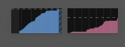
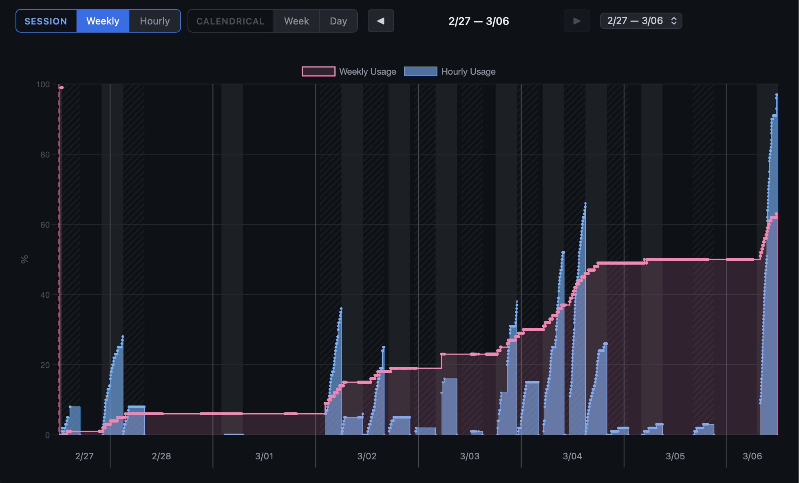
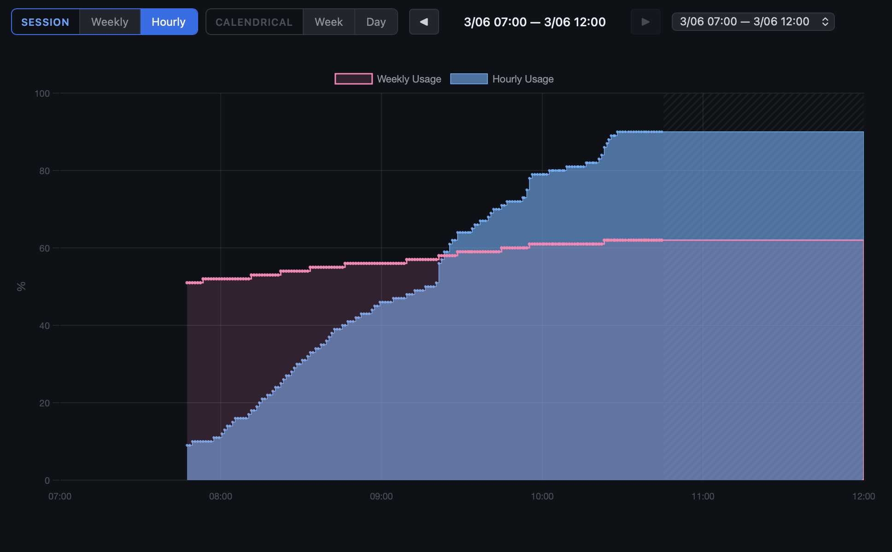
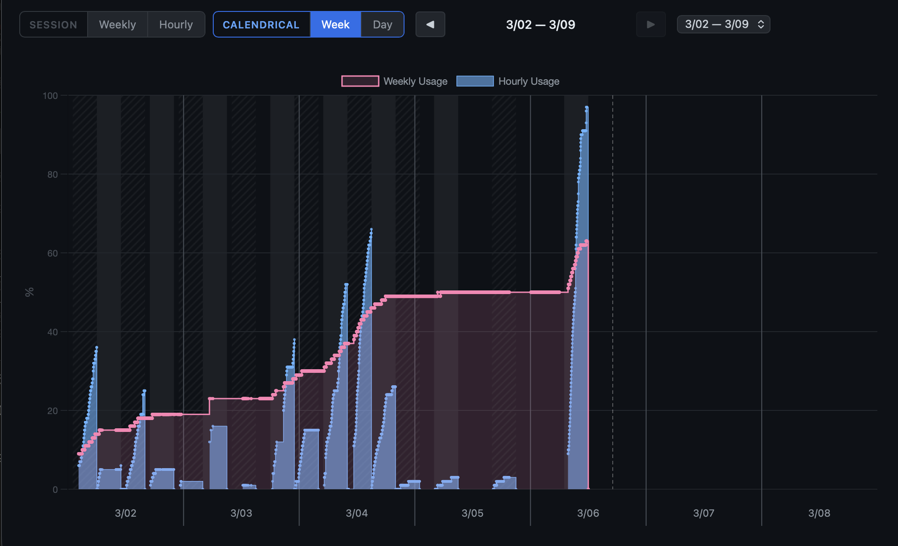
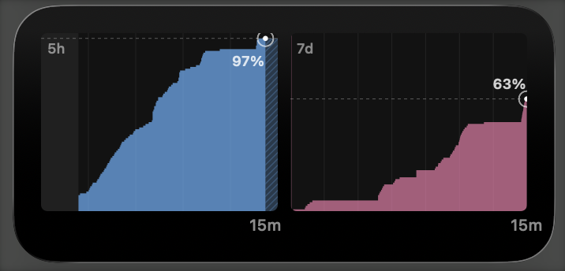

# ClaudeUsageTracker

macOS menu bar app for monitoring Claude Code usage limits — log, track, and analyze your usage trends.











## Download

**[Download the latest release](https://github.com/grad13/Claude-Usage-Tracker/releases/latest)** — download `ClaudeUsageTracker.app.zip`, unzip, and move to `/Applications`.

Requires macOS 14.0+. No Xcode or build tools needed.

## Why This Exists

Claude Code enforces 5-hour and 7-day usage limits, but the only way to check is to visit claude.ai manually. Several tools exist to show you the current usage percentage, but they give you a snapshot — you see where you are *right now*, not how you got there.

ClaudeUsageTracker logs your usage over time and provides three levels of detail:

| | When you look | What you see |
|---|---|---|
| **Menu bar** | Always visible | At-a-glance trend graphs (5h / 7d) |
| **Widgets** | When you're curious | Concrete numbers — percentages, reset times |
| **Analysis** | When you want to dig in | Full usage timeline with session navigation |

## Features

### Menu bar
- 5h and 7d usage trend graphs, always visible in the menu bar
- Step-interpolated area charts with session boundaries and reset points
- Auto-refresh at configurable intervals (default: 5 min)

### Widgets (WidgetKit)
- Small / Medium / Large sizes for your desktop
- Current usage %, time until reset
- Trend graphs with session markers

### Analysis page
- Usage timeline with hourly and weekly usage overlaid
- 4-mode navigation: Session Weekly / Hourly, Calendrical Week / Day
- Hourly session background bands and future zone indicators
- Interactive Chart.js charts with crosshair tooltips

### Other
- Start at Login (SMAppService)
- Threshold-based alerts for weekly and hourly usage
- Customizable graph colors and widths

## Usage

1. Launch the app — menu bar shows `5h: -- / 7d: --`
2. Click "Sign In..." and log in to claude.ai
3. Data fetches automatically — `5h: XX% / 7d: YY%`
4. Auto-refreshes every 5 minutes (manual: Cmd+R)
5. Enable "Start at Login" for auto-launch

## How It Works

Uses a WKWebView to maintain a browser session with claude.ai, then calls the internal usage API via JavaScript injection. No OAuth tokens or API keys are stored — authentication relies entirely on the browser session cookies.

## Build from Source

Requires Xcode 16+.

```bash
xcodebuild -project code/ClaudeUsageTracker.xcodeproj \
  -scheme ClaudeUsageTracker \
  -destination 'platform=macOS' build
```

## Related Projects

| Project | Approach | What It Shows |
|---------|----------|---------------|
| [ClaudeMeter](https://github.com/eddmann/ClaudeMeter) | macOS menu bar, session key | Current usage % |
| [AgentLimits](https://github.com/Nihondo/AgentLimits) | macOS menu bar, WKWebView login | Current usage % + token heatmap |
| **ClaudeUsageTracker** | macOS menu bar, WKWebView login | Usage log with menu bar / widget / analysis |

## Acknowledgments

The data-fetching approach (using WKWebView browser sessions to access internal APIs) is inspired by [AgentLimits](https://github.com/Nihondo/AgentLimits).

## License

MIT
