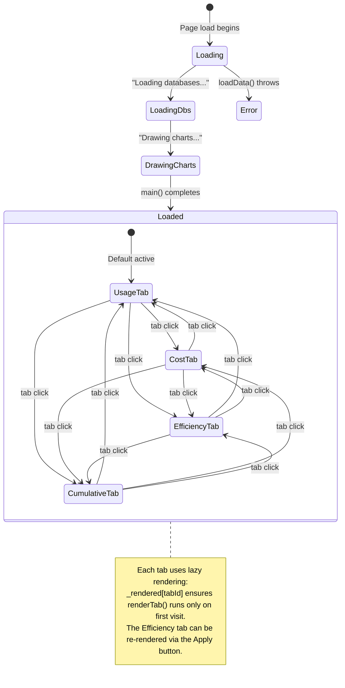

# Specification: AnalysisExporter

## 0. Meta

| Source | Runtime |
|--------|---------|
| `code/ClaudeUsageTracker/AnalysisExporter.swift` | Swift (container) + JavaScript/HTML/CSS (core) |

| Field | Value |
|-------|-------|
| Related | `documents/spec/analysis/overview.md`, `code/ClaudeUsageTracker/AnalysisSchemeHandler.swift`, `code/ClaudeUsageTracker/CostEstimator.swift` |
| Test Type | Unit (JS function logic) + Integration (end-to-end data flow) |

### Runtime Definition

| Value | Meaning |
|-------|---------|
| Swift (container) | Only `enum AnalysisExporter { static var htmlTemplate: String }`. No logic on the Swift side |
| JavaScript | All logic resides in `<script>` within the HTML template. Fetches JSON data via `cut://` endpoints, renders with Chart.js |

### Notes on the Source Table

- Although it is a Swift file, the substance is JS/HTML/CSS. The Swift side merely loads the HTML string from the bundle via `static var htmlTemplate`
- `AnalysisSchemeHandler` serves JSON data to the WKWebView via the `cut://` scheme (see Related)
- `MODEL_PRICING` is duplicated between `CostEstimator.swift` and JS (known limitation; see overview.md)

## 1. Contract

### Swift Side

```swift
enum AnalysisExporter {
    static var htmlTemplate: String  // computed property: loads analysis.html from bundle
}

private final class BundleAnchor {}  // defined inside AnalysisExporter
```

#### `BundleAnchor` Class

```swift
private final class BundleAnchor {}
```

- A private class defined inside the `AnalysisExporter` enum
- Purpose: serves as an anchor for `Bundle(for: BundleAnchor.self)` to locate the bundle this file belongs to
- Swift enums cannot be passed directly to `Bundle(for:)` (which requires `AnyClass`), so this dummy class is a common workaround
- In unit test environments, the XCTest bundle becomes the execution bundle, so when `BundleAnchor` is in a test target, `Bundle(for: BundleAnchor.self)` points to the test bundle

#### `htmlTemplate` Computed Property Implementation

```swift
static var htmlTemplate: String {
    guard let url = Bundle(for: BundleAnchor.self).url(forResource: "analysis", withExtension: "html"),
          let html = try? String(contentsOf: url, encoding: .utf8) else {
        return "<html><body>Failed to load analysis template</body></html>"
    }
    return html
}
```

- Uses `var` (computed property), not `let`
- Reads `analysis.html` from the bundle on every invocation (no caching)
- Bundle resource name: `"analysis"`, extension: `"html"`
- Fallback HTML on load failure: `"<html><body>Failed to load analysis template</body></html>"`

### JavaScript Side (Function Signatures)

```typescript
// --- Data Loading ---
async function loadData(): Promise<{ usageData: UsageRecord[], tokenData: TokenRecord[] }>
async function fetchJson(url: string): Promise<any[] | null>

// --- Cost Calculation ---
const MODEL_PRICING: {
  opus:   { input: 15.0,  output: 75.0, cacheWrite: 18.75, cacheRead: 1.50 },
  sonnet: { input: 3.0,   output: 15.0, cacheWrite: 3.75,  cacheRead: 0.30 },
  haiku:  { input: 0.80,  output: 4.0,  cacheWrite: 1.0,   cacheRead: 0.08 },
}
function pricingForModel(model: string): PricingObject
function costForRecord(r: RawTokenRecord): number  // USD

// --- Data Processing ---
function computeDeltas(usageData: UsageRecord[], tokenData: TokenRecord[]): Delta[]
function insertResetPoints(data: UsageRecord[], percentKey: string, resetsAtKey: string): Point[]
function computeKDE(values: number[]): { xs: number[], ys: number[] }
function getFilteredDeltas(): Delta[]

// --- Chart Rendering ---
function renderUsageTab(): void
function renderCostTab(): void
function renderEfficiencyTab(deltas: Delta[]): void
function renderCumulativeTab(): void
function renderTab(tabId: string): void
function buildScatterChart(canvasId: string, deltas: Delta[]): Chart
function buildHeatmap(deltas: Delta[]): void

// --- UI ---
function initTabs(): void
function main(usageData: UsageRecord[], tokenData: TokenRecord[]): void

// --- Types (implicit) ---
interface UsageRecord {
  timestamp: string
  hourly_percent: number | null
  weekly_percent: number | null
  hourly_resets_at: string | null
  weekly_resets_at: string | null
}
interface RawTokenRecord {
  timestamp: string
  model: string
  input_tokens: number
  output_tokens: number
  cache_read_tokens: number
  cache_creation_tokens: number
}
interface TokenRecord {
  timestamp: string
  costUSD: number
}
interface Delta {
  x: number        // intervalCost (USD)
  y: number        // delta hourly%
  hour: number     // 0-23
  timestamp: string
  date: Date
}
interface Point {
  x: string   // timestamp
  y: number   // percent
}
interface PricingObject {
  input: number
  output: number
  cacheWrite: number
  cacheRead: number
}
```

## 2. State (Mermaid)



### Tab Transition Details

- The `_rendered` object tracks per-tab rendered flags
- `renderTab()` is called only on the first click (subsequent clicks are skipped)
- Exception: the Efficiency tab's "Apply" button bypasses `_rendered` and re-executes `renderEfficiencyTab()`
- The Usage tab is rendered immediately inside `main()` (`_rendered['usage'] = true`)

## 3. Logic (Decision Table)

### 3.1 pricingForModel(model)

Selects a pricing table from the model string. Uses `String.includes()` for substring matching.

| Case ID | model | Expected | Notes |
|---------|-------|----------|-------|
| PM-01 | `"claude-opus-4-20250514"` | `MODEL_PRICING.opus` | Contains "opus" |
| PM-02 | `"claude-3-5-haiku-20241022"` | `MODEL_PRICING.haiku` | Contains "haiku" |
| PM-03 | `"claude-sonnet-4-20250514"` | `MODEL_PRICING.sonnet` | Contains "sonnet" |
| PM-04 | `"unknown-model-xyz"` | `MODEL_PRICING.sonnet` | Default fallback |
| PM-05 | `""` (empty string) | `MODEL_PRICING.sonnet` | Default fallback |
| PM-06 | `"opus-haiku-blend"` | `MODEL_PRICING.opus` | "opus" is evaluated first (priority: opus > haiku > sonnet) |

### 3.2 costForRecord(r)

Calculates USD cost from token counts and unit prices. Formula: `sum(tokens / 1M * price)`

| Case ID | input_tokens | output_tokens | cache_creation | cache_read | model | Expected (USD) | Notes |
|---------|-------------|--------------|----------------|------------|-------|----------------|-------|
| CR-01 | 1,000,000 | 0 | 0 | 0 | sonnet | 3.00 | Input only |
| CR-02 | 0 | 1,000,000 | 0 | 0 | sonnet | 15.00 | Output only |
| CR-03 | 0 | 0 | 1,000,000 | 0 | sonnet | 3.75 | cacheWrite only |
| CR-04 | 0 | 0 | 0 | 1,000,000 | sonnet | 0.30 | cacheRead only |
| CR-05 | 1,000 | 500 | 2,000 | 10,000 | sonnet | 1000/1M*3 + 500/1M*15 + 2000/1M*3.75 + 10000/1M*0.30 = 0.003 + 0.0075 + 0.0075 + 0.003 = 0.021 | Combined case |
| CR-06 | 0 | 0 | 0 | 0 | sonnet | 0.0 | All zeros |
| CR-07 | 1,000,000 | 0 | 0 | 0 | opus | 15.00 | Opus pricing applied |
| CR-08 | 0 | 0 | 0 | 1,000,000 | opus | 1.50 | Opus cacheRead (5x sonnet) |
| CR-09 | 0 | 0 | 0 | 1,000,000 | haiku | 0.08 | Haiku cacheRead (cheapest) |

### 3.3 computeDeltas(usageData, tokenData)

Computes delta-hourly% and interval cost between consecutive usage records.

| Case ID | usageData | tokenData | Expected | Notes |
|---------|-----------|-----------|----------|-------|
| CD-01 | `[{t:"T1", hourly%:10}, {t:"T2", hourly%:30}]` | `[{t:"T1.5", costUSD:0.5}]` | `[{x:0.5, y:20, hour:H(T2)}]` | Basic: cost between T1-T2=0.5, delta=20% |
| CD-02 | `[{t:"T1", hourly%:10}, {t:"T2", hourly%:30}]` | `[{t:"T1.5", costUSD:0.0005}]` | `[]` | intervalCost <= 0.001 is excluded |
| CD-03 | `[{t:"T1", hourly%:null}, {t:"T2", hourly%:30}]` | `[{t:"T1.5", costUSD:1.0}]` | `[]` | prev hourly_percent is null -> skip |
| CD-04 | `[{t:"T1", hourly%:10}, {t:"T2", hourly%:null}]` | `[{t:"T1.5", costUSD:1.0}]` | `[]` | curr hourly_percent is null -> skip |
| CD-05 | `[{t:"T1", hourly%:50}]` | `[{t:"T1", costUSD:1.0}]` | `[]` | Only 1 usage record -> loop never starts, empty result |
| CD-06 | `[{t:"T1", hourly%:10}, {t:"T2", hourly%:30}]` | `[]` | `[]` | No tokens -> intervalCost=0 -> excluded |
| CD-07 | `[{t:"T1", hourly%:10}, {t:"T2", hourly%:30}, {t:"T3", hourly%:25}]` | `[{t:"T1.5", costUSD:0.5}, {t:"T2.5", costUSD:0.3}]` | `[{x:0.5, y:20}, {x:0.3, y:-5}]` | Negative delta (usage rate decreased) |
| CD-08 | `[{t:"T1", hourly%:10}, {t:"T2", hourly%:30}]` | `[{t:"T0", costUSD:1.0}]` | `[]` | Token timestamp outside interval (t < T1) -> intervalCost=0 |
| CD-09 | `[{t:"T1", hourly%:10}, {t:"T2", hourly%:30}]` | `[{t:"T1", costUSD:0.5}, {t:"T1.5", costUSD:0.3}]` | `[{x:0.8, y:20}]` | Multiple tokens in interval -> summed (t0 <= t < t1) |

**Note**: The token filter condition is `t >= t0 && t < t1` (half-open interval including t0, excluding t1).

### 3.4 insertResetPoints(data, percentKey, resetsAtKey)

When a resets_at timestamp falls between prev and curr, inserts a usage-rate-0 point to visualize the reset.

| Case ID | data | percentKey | Expected | Notes |
|---------|------|-----------|----------|-------|
| RP-01 | `[{t:10:00, hourly%:30, resets:10:30}, {t:11:00, hourly%:15}]` | `hourly_percent` | `[{x:10:00, y:30}, {x:10:30, y:0}, {x:11:00, y:15}]` | resets_at between prev.t and curr.t -> zero point inserted |
| RP-02 | `[{t:10:00, hourly%:30, resets:09:00}, {t:11:00, hourly%:15}]` | `hourly_percent` | `[{x:10:00, y:30}, {x:11:00, y:15}]` | resets_at < prev.t -> no insertion |
| RP-03 | `[{t:10:00, hourly%:30, resets:12:00}, {t:11:00, hourly%:15}]` | `hourly_percent` | `[{x:10:00, y:30}, {x:11:00, y:15}]` | resets_at > curr.t -> no insertion |
| RP-04 | `[{t:10:00, hourly%:30, resets:null}, {t:11:00, hourly%:15}]` | `hourly_percent` | `[{x:10:00, y:30}, {x:11:00, y:15}]` | resets_at is null -> no insertion |
| RP-05 | `[{t:10:00, hourly%:null}, {t:11:00, hourly%:15}]` | `hourly_percent` | `[{x:11:00, y:15}]` | percent is null -> row itself is skipped |
| RP-06 | `[{t:10:00, hourly%:30, resets:10:30}, {t:11:00, hourly%:null}, {t:12:00, hourly%:20, resets:null}]` | `hourly_percent` | `[{x:10:00, y:30}, {x:10:30, y:0}, {x:12:00, y:20}]` | null in between; lastValidIdx tracks prev |
| RP-07 | `[]` | `hourly_percent` | `[]` | Empty array |
| RP-08 | `[{t:10:00, hourly%:50}]` | `hourly_percent` | `[{x:10:00, y:50}]` | Single record -> no reset evaluation |

**Note**: The comparison target for resets_at is `prev` (the most recent valid record), not curr. The condition is `resetTime > prevTime && resetTime < currTime` (strict open interval).

### 3.5 computeKDE(values)

Computes a Gaussian KDE with bandwidth determined by Silverman's rule.

| Case ID | values | Expected | Notes |
|---------|--------|----------|-------|
| KDE-01 | `[]` | `{ xs: [], ys: [] }` | n=0 < 2 -> empty |
| KDE-02 | `[5.0]` | `{ xs: [], ys: [] }` | n=1 < 2 -> empty |
| KDE-03 | `[1.0, 2.0, 3.0]` | xs.length=201, ys are all >= 0, ys peak near mean=2.0 | Normal case. h = 1.06 * std * 3^(-0.2) |
| KDE-04 | `[5.0, 5.0, 5.0]` | xs.length=201, h = 1.06 * 1 * 3^(-0.2) | std=0 -> fallback to std=1 (code: `Math.sqrt(variance) \|\| 1`) |
| KDE-05 | `[0.0, 100.0]` | xs range is `min - 3h` to `max + 3h` | Large range |

**Formula**:
- Bandwidth: `h = 1.06 * std * n^(-0.2)` (if std=0 then std=1)
- Evaluation range: `[min(values) - 3h, max(values) + 3h]`, step = `(hi - lo) / 200`
- Density: `coeff = 1 / (n * h * sqrt(2pi))`, `density(x) = coeff * Sigma(exp(-0.5 * ((x - xi) / h)^2))`

### 3.6 isGapSegment(ctx)

Chart.js segment callback. Determines whether the time difference between two points exceeds a threshold.

| Case ID | p1.x - p0.x (ms) | gapThresholdMs | Expected | Notes |
|---------|-------------------|----------------|----------|-------|
| GS-01 | 1,800,001 | 1,800,000 (30min) | `true` | Exceeds threshold (by 1ms) |
| GS-02 | 1,800,000 | 1,800,000 (30min) | `false` | Exactly at threshold (`>` so false) |
| GS-03 | 1,799,999 | 1,800,000 (30min) | `false` | Below threshold |
| GS-04 | 21,600,001 | 21,600,000 (360min) | `true` | Slider maximum |
| GS-05 | 300,001 | 300,000 (5min) | `true` | Slider minimum |

**Global state**: `gapThresholdMs` is dynamically changed via slider (default 30 * 60 * 1000 = 1,800,000ms).

### 3.7 buildHeatmap(deltas)

Generates an efficiency heatmap on a day-of-week (0-6) x hour (0-23) grid.

| Case ID | deltas | Expected | Notes |
|---------|--------|----------|-------|
| HM-01 | `[{x:1.0, y:10, date:Mon 14:00}]` | grid[1][14] = ratio 10.0, color at maxR | Single cell, ratio = totalDelta / totalCost |
| HM-02 | `[{x:0.5, y:10, date:Mon 14:00}, {x:0.5, y:20, date:Mon 14:00}]` | grid[1][14]: totalDelta=30, totalCost=1.0, ratio=30.0 | Aggregated into same cell |
| HM-03 | `[{x:0.0005, y:5, date:Tue 10:00}]` | grid[2][10]: totalCost=0.0005 <= 0.001 -> ratio=null, color=#161b22, title="n=1, no cost data" | Insufficient cost for ratio calculation |
| HM-04 | `[]` | All cells ratio=null, color=#161b22 | Empty data |
| HM-05 | Negative ratio present | t is clamped via `Math.max(0, Math.min(1, ...))` to [0,1] | Normalized based on minR/maxR |

**Color calculation**:
- `t = clamp((ratio - minR) / (maxR - minR + 0.001), 0, 1)`
- `R = round(40 + t * 180)`, `G = round(180 - t * 140)`, `B = 40`
- Output: `rgba(R, G, B, 0.8)`
- When ratio=null: `#161b22` (card background color)

**Grid structure**: `heatmap-grid` = 25 columns (1 label + 24 hours) x 8 rows (1 header + 7 days-of-week).

### 3.8 getFilteredDeltas()

Filters `_allDeltas` by date range.

| Case ID | dateFrom | dateTo | _allDeltas | Expected | Notes |
|---------|----------|--------|------------|----------|-------|
| FD-01 | `"2026-02-20"` | `"2026-02-22"` | Data from 2/19, 2/20, 2/21, 2/23 | Only 2/20 and 2/21 | from=T00:00:00, to=T23:59:59 |
| FD-02 | `""` (empty) | `"2026-02-22"` | Any | All of `_allDeltas` | from is empty -> no filter |
| FD-03 | `"2026-02-20"` | `""` (empty) | Any | All of `_allDeltas` | to is empty -> no filter |
| FD-04 | `""` | `""` | Any | All of `_allDeltas` | Both empty -> no filter |
| FD-05 | `"2026-02-25"` | `"2026-02-20"` | Data from 2/22 | `[]` | from > to -> no matching data |

### 3.9 main(usageData, tokenData) -- Summary Statistics

| Case ID | usageData | tokenData | Expected stats | Notes |
|---------|-----------|-----------|----------------|-------|
| MN-01 | 100 records, latest hourly%=42, weekly%=18 | 500 records, totalCost=12.34 | Records:100, Token:500, Cost:$12.34, hourly:42%, weekly:18% | Normal |
| MN-02 | 1 record, hourly%=null, weekly%=null | 0 records | Records:1, Token:0, Cost:$0.00, Span:0, hourly:-, weekly:- | Minimal data |
| MN-03 | 0 records | 0 records | Records:0, Token:0, Cost:$0.00, Span:0, hourly:-, weekly:- | Empty data |
| MN-04 | 2 records, T1="2026-02-20T10:00", T2="2026-02-20T15:00" | Any | Span: 5.0h | (T2 - T1) / 3600000 |

**Usage Span calculation**: `(last.timestamp - first.timestamp) / 3600000` displayed with `.toFixed(1)`. Shows `"0"` for 1 or fewer records.

### 3.10 formatMin(m) -- Gap Slider Display

| Case ID | m (minutes) | Expected | Notes |
|---------|-------------|----------|-------|
| FM-01 | 5 | `"5 min"` | Minimum value |
| FM-02 | 30 | `"30 min"` | Default |
| FM-03 | 59 | `"59 min"` | Largest below 1 hour |
| FM-04 | 60 | `"1h"` | Exactly 1 hour (remainder 0 -> no minutes shown) |
| FM-05 | 90 | `"1h 30min"` | Hours + minutes |
| FM-06 | 360 | `"6h"` | Maximum value |

### 3.11 timeSlots -- Time-of-Day Classification

Constant array for coloring scatter plot data points by time-of-day.

| Slot | Time Range | Color | Filter Condition |
|------|-----------|-------|-----------------|
| Night | 0-5h (0 <= h < 6) | `rgba(100,150,255,0.7)` blue | `d.hour < 6` |
| Morning | 6-11h (6 <= h < 12) | `rgba(255,200,80,0.7)` yellow | `d.hour >= 6 && d.hour < 12` |
| Afternoon | 12-17h (12 <= h < 18) | `rgba(255,130,80,0.7)` orange | `d.hour >= 12 && d.hour < 18` |
| Evening | 18-23h (18 <= h) | `rgba(180,100,255,0.7)` purple | `d.hour >= 18` |

### 3.12 renderCumulativeTab() -- Cumulative Cost

| Case ID | tokenData | Expected | Notes |
|---------|-----------|----------|-------|
| RC-01 | `[{t:T1, cost:1.005}, {t:T2, cost:2.345}]` | `[{x:T1, y:1.01}, {x:T2, y:3.35}]` | `Math.round(cumCost * 100) / 100` rounds to 2 decimal places |
| RC-02 | `[]` | `[]` (empty dataset) | tokenData empty |

## 4. Side Effects (Integration)

| Type | Description |
|------|-------------|
| Network (CDN) | `https://cdn.jsdelivr.net/npm/chart.js@4` -- Chart.js library |
| Network (CDN) | `https://cdn.jsdelivr.net/npm/chartjs-adapter-date-fns@3` -- Date adapter |
| Store (fetch) | `cut://usage.json` -- SELECT from usage_log table (AnalysisSchemeHandler serves as JSON) |
| Store (fetch) | `cut://tokens.json` -- SELECT from token_records table (AnalysisSchemeHandler serves as JSON). Data is auto-synced via UsageViewModel fetch cycle (fetchPredict -> TokenStore.sync) |
| Store (fetch) | `cut://meta.json` -- Aggregate query results from usage_log + weekly_sessions served as JSON |
| DOM | `#loading` -- text update + display:none |
| DOM | `#app` -- display:'' to show |
| DOM | `#stats` -- innerHTML generates summary statistic cards |
| DOM | `#heatmap` -- innerHTML generates heatmap HTML |
| DOM | 6 x `<canvas>` -- Chart.js instances render charts (usageTimeline, costTimeline, costScatter, effScatter, kdeChart, cumulativeCost) |
| DOM | `#gapSlider` -- input event updates `gapThresholdMs` + chart.update() |
| DOM | `#applyRange` -- click event re-renders Efficiency tab |
| DOM | `.tab-btn` -- click event for tab switching + lazy rendering |
| Global State | `_usageData`, `_tokenData`, `_allDeltas` -- set in main() |
| Global State | `_charts` -- Chart.js instance cache (for destroy) |
| Global State | `_rendered` -- per-tab rendered flags |
| Global State | `gapThresholdMs` -- gap threshold (changed via slider) |

## 5. Notes

- **Duplication**: `MODEL_PRICING` (JS) and `CostEstimator.swift` (Swift) define model pricing separately. Both must be updated together when prices change
- **Full SELECT**: `loadData()` fetches all records from usage_log / token_records. Performance with large datasets is unverified
- **CDN dependency**: Chart.js does not work offline (dynamically loaded from CDN). The sql.js/WASM dependency has been eliminated
- **fetchJson error handling**: Returns `null` on fetch failure; the corresponding data array becomes empty. Errors are only logged via console.warn
- **Date parsing**: Timestamps are implicitly parsed via `new Date(string)`. ISO 8601 format is assumed
- **Efficiency tab specifics**: The Apply button ignores the `_rendered` flag and re-renders every time. Existing Chart instances are `.destroy()`ed before recreation
- **Gap segment**: Chart.js's `segment` property sets borderColor/backgroundColor to `'transparent'` to hide lines. Slider changes are reflected without full chart redraw (`_charts.usageTimeline.update()` only)
- **Heatmap color scale**: Normalized by the overall min/max ratio of the data, so outliers can reduce contrast in other cells
- **Data serving architecture**: Migrated from the old design (sql.js/WASM DB binary serving) to Swift-side SQLite queries + JSON serving. `AnalysisExporter.htmlTemplate` loads `analysis.html` from the bundle, and `AnalysisSchemeHandler` serves JSON endpoints via the `cut://` scheme
