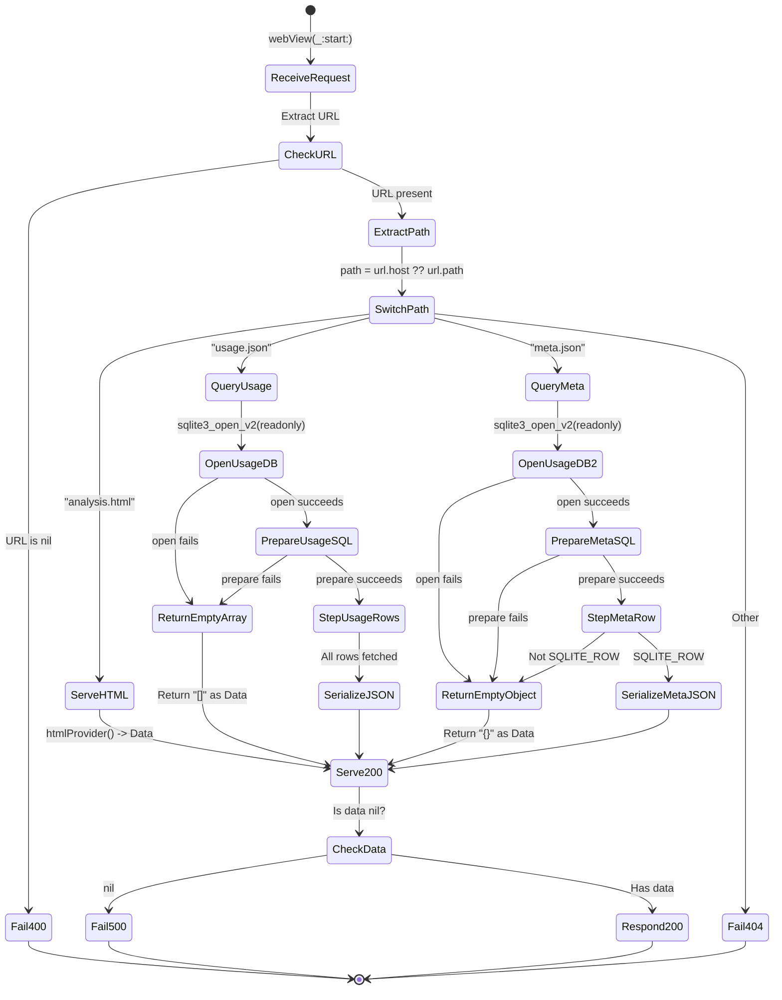

# Specification: AnalysisSchemeHandler

## 0. Meta

| Source | Runtime |
|--------|---------|
| `code/ClaudeUsageTracker/AnalysisSchemeHandler.swift` | Swift |

| Field | Value |
|-------|-------|
| Related | `code/ClaudeUsageTracker/AnalysisExporter.swift`, `code/ClaudeUsageTrackerShared/SQLiteHelper.swift`, `documents/spec/analysis/overview.md` |
| Test Type | Unit |

## 1. Contract (Swift)

> AI Instruction: Treat this type definition as the single source of truth and use it for mocks and test types.

```swift
final class AnalysisSchemeHandler: NSObject, WKURLSchemeHandler {

    static let scheme: String  // = "cut"

    private let usageDbPath: String
    private let htmlProvider: () -> String

    init(usageDbPath: String, htmlProvider: @escaping () -> String)

    // WKURLSchemeHandler protocol
    func webView(_ webView: WKWebView, start urlSchemeTask: WKURLSchemeTask)
    func webView(_ webView: WKWebView, stop urlSchemeTask: WKURLSchemeTask)

    // SQLite Queries (private)
    private func queryUsageJSON(from: String?, to: String?) -> Data?
    private func queryMetaJSON() -> Data?

    // Helpers (private)
    private func parseQueryParams(_ url: URL) -> [String: String]
    private func serializeJSON(_ rows: [[String: Any?]]) -> Data?
    private func serve(_ task: WKURLSchemeTask, url: URL, data: Data?, mime: String)
    private func fail(_ task: WKURLSchemeTask, code: Int, message: String)

    // Note: columnText/columnDouble/columnInt are static methods on SQLiteHelper
    // SQLiteHelper.columnText(_ stmt: OpaquePointer, _ index: Int32) -> String?
    // SQLiteHelper.columnDouble(_ stmt: OpaquePointer, _ index: Int32) -> Double?
    // SQLiteHelper.columnInt(_ stmt: OpaquePointer, _ index: Int32) -> Int?
}
```

## 2. State (Mermaid)

> AI Instruction: Generate tests covering all paths (Success/Failure/Edge) in this state diagram.



## 3. Logic (Decision Table)

> AI Instruction: Generate each row as an XCTest parameterized test (individual test methods or a loop).

### start handler

| Case ID | URL | path | Expected | Notes |
|---------|-----|------|----------|-------|
| UT-01 | `cut://analysis.html` | `"analysis.html"` | 200 + Content-Type: `text/html` | Serves htmlProvider() result |
| UT-02 | `cut://usage.json` | `"usage.json"` | 200 + Content-Type: `application/json` | Serves SQLite query result as JSON |
| UT-03b | `cut://meta.json` | `"meta.json"` | 200 + Content-Type: `application/json` | Serves aggregate query result from usage_log + weekly_sessions as JSON |
| UT-03c | `cut://meta.json` (DB absent) | `"meta.json"` | 200 + body: `{}` | Returns empty object JSON on DB open failure |
| UT-04 | `cut://unknown.txt` | `"unknown.txt"` | 404 + body: `"Not found: unknown.txt"` | Unregistered path |
| UT-05 | nil | - | 400 + body: `"Missing URL"` | URL missing |
| UT-06 | `cut://usage.json` | `"usage.json"` (DB absent) | 200 + body: `[]` | Returns empty array JSON on DB open failure (not 404) |

### queryUsageJSON

| Case ID | Condition | Expected | Notes |
|---------|-----------|----------|-------|
| UT-08 | DB open fails | `"[]"` (Data) | `sqlite3_open_v2` does not return `SQLITE_OK` |
| UT-09 | SQL prepare fails | `"[]"` (Data) | `sqlite3_prepare_v2` does not return `SQLITE_OK` |
| UT-10 | 0 rows | `"[]"` (Data) | Table is empty |
| UT-11 | N rows present | JSON array (N elements) | Each element: `timestamp`, `hourly_percent`, `weekly_percent`, `hourly_resets_at`, `weekly_resets_at` |
| UT-12 | NULL column | `null` in JSON | `columnText`/`columnDouble` returns nil -> converted to `NSNull()` |

**SQL:**
```sql
SELECT u.timestamp, u.hourly_percent, u.weekly_percent,
       hs.resets_at AS hourly_resets_at,
       ws.resets_at AS weekly_resets_at
FROM usage_log u
LEFT JOIN hourly_sessions hs ON u.hourly_session_id = hs.id
LEFT JOIN weekly_sessions ws ON u.weekly_session_id = ws.id
[WHERE u.timestamp >= ? AND u.timestamp <= ?]
ORDER BY u.timestamp ASC
```

### queryMetaJSON

| Case ID | Condition | Expected | Notes |
|---------|-----------|----------|-------|
| UT-M01 | DB open fails | `"{}"` (Data) | Usage DB does not exist |
| UT-M02 | SQL prepare fails | `"{}"` (Data) | Schema mismatch, etc. |
| UT-M03 | `sqlite3_step` does not return `SQLITE_ROW` | `"{}"` (Data) | Table is empty |
| UT-M04 | Normal (data present) | `{ latestSevenDayResetsAt: Int, latestTimestamp: Int, oldestTimestamp: Int }` | NULL becomes `null` |
| UT-M05 | weekly_sessions is empty (NULL from LEFT JOIN) | `{ latestSevenDayResetsAt: null, latestTimestamp: Int, oldestTimestamp: Int }` | LEFT JOIN returns SQLITE_ROW as long as usage_log has data |
| UT-M06 | usage_log has data, weekly/hourly_sessions have data | `{ latestSevenDayResetsAt, latestTimestamp, oldestTimestamp, weeklySessions: [...], hourlySessions: [...] }` | All fields output |
| UT-M07 | usage_log has data, sessions tables empty | `{ latestSevenDayResetsAt, latestTimestamp, oldestTimestamp, weeklySessions: [], hourlySessions: [] }` | hasUsageData=true so keys exist (empty arrays) |
| UT-M08 | usage_log empty, sessions tables have data | `{ weeklySessions: [...], hourlySessions: [...] }` | hasUsageData=false but sessions non-empty |
| UT-M09 | usage_log empty, sessions tables empty | `{}` | All empty → result is empty |
| UT-M10 | sessions id or resets_at is NULL | Key omitted from session object | `if let` guard skips nil keys |

**SQL:**
```sql
SELECT MAX(ws.resets_at), MAX(u.timestamp), MIN(u.timestamp)
FROM usage_log u
LEFT JOIN weekly_sessions ws ON u.weekly_session_id = ws.id
```

**Return JSON keys:**

| Column Position | SQL | JSON Key | Type |
|----------------|-----|----------|------|
| 0 | `MAX(ws.resets_at)` | `latestSevenDayResetsAt` | `Int?` (epoch) |
| 1 | `MAX(u.timestamp)` | `latestTimestamp` | `Int?` (epoch) |
| 2 | `MIN(u.timestamp)` | `oldestTimestamp` | `Int?` (epoch) |

All columns are read via `columnInt`; nil values are converted to `NSNull()` for JSON serialization.

### queryMetaJSON: hasUsageData Condition Flag

`queryMetaJSON` uses an internal flag `hasUsageData: Bool` to control the response structure based on the aggregate query result.

| Condition | hasUsageData | Notes |
|-----------|-------------|-------|
| `sqlite3_step` does not return `SQLITE_ROW` | `false` | usage_log table is empty |
| `SQLITE_ROW` but both `latestTimestamp` and `oldestTimestamp` are nil | `false` | Aggregate result is all NULL |
| `SQLITE_ROW` and `latestTimestamp` or `oldestTimestamp` is non-nil | `true` | usage_log has data |

Aggregate meta fields (`latestSevenDayResetsAt`, `latestTimestamp`, `oldestTimestamp`) are only added to `result` when `hasUsageData == true`.

### queryMetaJSON: Session List (weeklySessions / hourlySessions)

After the aggregate query, session lists are fetched from `weekly_sessions` and `hourly_sessions` tables.

**SQL (per table):**

```sql
SELECT id, resets_at FROM weekly_sessions ORDER BY resets_at ASC
SELECT id, resets_at FROM hourly_sessions ORDER BY resets_at ASC
```

**JSON key mapping:**

| JSON Key | Table |
|----------|-------|
| `weeklySessions` | `weekly_sessions` |
| `hourlySessions` | `hourly_sessions` |

Each session element contains `id` (Int?) and `resets_at` (Int?, epoch). Keys with nil values are omitted from the object (not NSNull).

**Output condition:**

| hasUsageData | sessions array | Key added to result |
|-------------|--------------|---------------------|
| `true` | empty | Yes (empty array `[]`) |
| `true` | non-empty | Yes |
| `false` | empty | No (key omitted) |
| `false` | non-empty | Yes |

Condition: `hasUsageData || !sessions.isEmpty`

### Date Range Filter (from / to Parameters)

`queryUsageJSON` supports filtering via the `from` and `to` query parameters.

**Parameter extraction:** `parseQueryParams(_ url: URL)` parses the URL query string and extracts `from` and `to`.

**queryUsageJSON filter behavior:**

| Condition | Behavior |
|-----------|----------|
| Both `from` and `to` are present and convertible to `Int64` | `WHERE u.timestamp >= ? AND u.timestamp <= ?` (compared as epoch seconds) |
| Either is missing or non-numeric | No WHERE clause (returns all records) |

Binding: Uses `sqlite3_bind_int64`. Type is `Int64`.

**Decision Table (with filter):**

| Case ID | URL | Condition | Expected | Notes |
|---------|-----|-----------|----------|-------|
| UT-F01 | `cut://usage.json?from=1700000000&to=1700003600` | from/to convertible to Int64 | Returns only rows in specified range | WHERE clause present |
| UT-F02 | `cut://usage.json?from=abc&to=1700003600` | from is non-numeric | Returns all rows | No WHERE clause |
| UT-F03 | `cut://usage.json` | No parameters | Returns all rows | No WHERE clause |

### columnInt Helper

Uses `SQLiteHelper.columnInt(_ stmt: OpaquePointer, _ index: Int32) -> Int?` (see Contract section).

- If `sqlite3_column_type` is `SQLITE_NULL`: returns `nil`
- Otherwise: returns `Int(sqlite3_column_int64(stmt, idx))`
- Used for epoch timestamps in `queryUsageJSON` (`timestamp`, `hourly_resets_at`, `weekly_resets_at`) and all columns in `queryMetaJSON`

Test cases belong to the `SQLiteHelper` spec.

### parseQueryParams Helper

```swift
private func parseQueryParams(_ url: URL) -> [String: String]
```

- Parses the URL using `URLComponents(url:resolvingAgainstBaseURL:)`
- If `queryItems` is nil: returns an empty dictionary `[:]`
- Skips any `URLQueryItem` with a nil `value` (key-only items are not included in the dictionary)

### serializeJSON

| Case ID | Input | Expected | Notes |
|---------|-------|----------|-------|
| UT-17 | `[[String: Any?]]` with Optional nil | `null` in JSON | `nil` -> `NSNull()` conversion before `JSONSerialization` |
| UT-18 | Empty array `[]` | `[]` (Data) | |

### init

| Case ID | Input | Expected | Notes |
|---------|-------|----------|-------|
| UT-19 | Valid paths + htmlProvider | `usageDbPath`, `htmlProvider` are stored | No `fileMap` construction |

### Response Headers (Success 200)

| Header | Value |
|--------|-------|
| Content-Type | `mime` argument passed to `serve()` |
| Content-Length | `"\(data.count)"` |
| Access-Control-Allow-Origin | `"*"` |

### Response Headers (Error 400/404/500)

| Header | Value |
|--------|-------|
| Content-Type | `"text/plain"` |

### serve Method

| Case ID | data | Expected | Notes |
|---------|------|----------|-------|
| UT-20 | nil | 500 + body: `"Failed to generate response"` | Data generation failed |
| UT-21 | Valid Data | 200 + headers + body | Normal response |

## 4. Side Effects (Integration)

> AI Instruction: Spy/mock the following side effects for integration tests.

| Type | Description |
|------|-------------|
| SQLite | Opens `usageDbPath` READONLY via `SQLiteHelper.withDatabase(path:flags:)` |
| SQLite | `SQLiteHelper.withStatement(db:sql:)` -> `sqlite3_step` -> `SQLiteHelper.columnText/columnDouble/columnInt` to read rows |
| SQLite | DB/Statement lifecycle is automatically managed by SQLiteHelper via defer |
| WKWebView | Calls `WKURLSchemeTask.didReceive(URLResponse)`, `.didReceive(Data)`, `.didFinish()` |

## 5. Notes

- The `cut://` scheme is used to bypass CORS restrictions within WKWebView
- Migrated from the old design (sql.js/WASM DB binary serving) to Swift-side SQLite queries + JSON serving. Eliminated CDN dependency (sql.js/WASM)
- The `stop` handler is an empty implementation. SQLite queries are synchronous and complete immediately, so no cancellation logic is needed
- DB queries are executed on every request (no caching). Always returns the latest data
- On DB open/prepare failure, returns an empty array `[]` (not 404). This simplifies error handling on the JS side
- The `fail` method uses `cut://error` as a fallback URL when the URL is nil
- `serializeJSON` converts Optional nil to `NSNull()`. `JSONSerialization` cannot handle Swift Optionals directly
- `SQLiteHelper.columnText`, `SQLiteHelper.columnDouble`, `SQLiteHelper.columnInt` include `SQLITE_NULL` checks. NULL columns return `nil`
- SQLite operations are abstracted through the `SQLiteHelper` enum (`code/ClaudeUsageTrackerShared/SQLiteHelper.swift`). `withDatabase`/`withStatement` automatically manage the open/prepare/close/finalize lifecycle
- `queryUsageJSON` reads epoch timestamps as `Int64` from SQLite, converts to `Int`, and includes them in the JSON
- Without filters, all records are SELECTed (performance depends on data volume)
- `queryMetaJSON` always returns either a single row (aggregate query) or `{}` on failure
