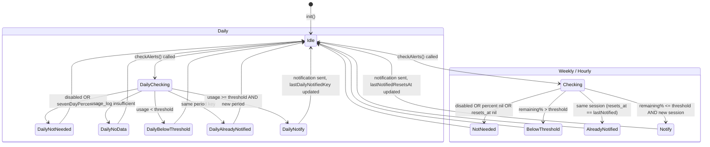

# Specification: Alert (AlertChecker + NotificationManager)

## 0. Meta

| Source | Runtime |
|--------|---------|
| code/ClaudeUsageTracker/AlertChecker.swift | Swift |
| code/ClaudeUsageTracker/NotificationManager.swift | Swift |

| Field | Value |
|-------|-------|
| Related | spec/data/settings.md, spec/data/usage-store.md, spec/meta/protocols.md, spec/meta/viewmodel-lifecycle.md |
| Test Type | Unit |

## 1. Contract (Swift)

> AI Instruction: Treat this type definition as the single source of truth. Use it for mocks and test types.

### AlertChecker

```swift
final class AlertChecker {
    static let shared = AlertChecker()

    enum AlertKind: String {
        case weekly, hourly, daily
    }

    private let notificationSender: any NotificationSending
    private let usageStore: any UsageStoring

    // Duplicate notification prevention (in-memory)
    // key = AlertKind, value = normalized resets_at epoch (Int)
    private(set) var lastNotifiedResetsAt: [AlertKind: Int] = [:]

    // Duplicate notification prevention key for Daily alerts
    // Date-based: "2026-02-27", session-based: String(normalizedResetsAt)
    private(set) var lastDailyNotifiedKey: String?

    init(
        notificationSender: any NotificationSending = DefaultNotificationSender(),
        usageStore: any UsageStoring = UsageStore.shared
    )

    /// Called from applyResult() on successful fetch (synchronous method).
    /// Notification delivery is performed internally via Task {} fire-and-forget.
    func checkAlerts(result: UsageResult, settings: AppSettings)
}
```

### NotificationManager

```swift
final class NotificationManager {
    static let shared = NotificationManager()
    private let center: UNUserNotificationCenter  // = .current()

    func requestAuthorization() async -> Bool
    func send(title: String, body: String, identifier: String) async
}
```

#### requestAuthorization() implementation details

```swift
func requestAuthorization() async -> Bool {
    do {
        return try await center.requestAuthorization(options: [.alert, .sound])
    } catch {
        NSLog("[NotificationManager] requestAuthorization failed: %@", "\(error)")
        return false
    }
}
```

- Requested permissions: `.alert` (banner display) and `.sound` (notification sound)
- On success: returns the OS result (`Bool`) as-is (returns `false` if the user denied permission)
- On failure (exception): logs via NSLog and returns `false`

#### send() implementation details

```swift
func send(title: String, body: String, identifier: String) async {
    let content = UNMutableNotificationContent()
    content.title = title
    content.body = body
    content.sound = .default  // Use system default sound

    let request = UNNotificationRequest(
        identifier: identifier,
        content: content,
        trigger: nil  // Immediate delivery
    )
    // center.add(request) — on failure, NSLog only, no retry
}
```

- `content.sound = .default`: plays the macOS/iOS system default notification sound. No custom sound is used.
- Since `.sound` is requested via `requestAuthorization` (`options: [.alert, .sound]`), the sound plays if the user has granted sound permission.
- `trigger: nil` means immediate delivery. The notification is delivered right after calling `center.add(request)`.
- Failure handling:

```swift
do {
    try await center.add(request)
} catch {
    NSLog("[NotificationManager] send failed (%@): %@", identifier, "\(error)")
}
```

- On `add()` failure, only the identifier and error are logged via NSLog. No retry (the next fetch + checkAlerts() cycle will re-evaluate).

### AlertChecking protocol (added in Protocols.swift)

```swift
protocol AlertChecking {
    func checkAlerts(result: UsageResult, settings: AppSettings)
}

struct DefaultAlertChecker: AlertChecking {
    func checkAlerts(result: UsageResult, settings: AppSettings) {
        AlertChecker.shared.checkAlerts(result: result, settings: settings)
    }
}
```

### NotificationSending protocol (added in Protocols.swift)

```swift
protocol NotificationSending {
    func requestAuthorization() async -> Bool
    func send(title: String, body: String, identifier: String) async
}

struct DefaultNotificationSender: NotificationSending {
    func requestAuthorization() async -> Bool {
        await NotificationManager.shared.requestAuthorization()
    }
    func send(title: String, body: String, identifier: String) async {
        await NotificationManager.shared.send(title: title, body: body, identifier: identifier)
    }
}
```

## 2. State (Mermaid)

### AlertChecker in-memory state transitions



### Reset on session change

```
resets_at changes (new session starts)
  -> lastNotifiedResetsAt[.weekly/.hourly] automatically becomes a mismatch
  -> Threshold evaluation becomes active again on the next checkAlerts() call
```

### App restart

```
App restart
  -> lastNotifiedResetsAt = [:], lastDailyNotifiedKey = nil (lost because in-memory only)
  -> May re-notify within the same session (acceptable)
```

## 3. Logic (Decision Table)

> AI Instruction: Generate a Unit Test for each row as a parameterized XCTest (per-case test method or loop).

### 3.1 Weekly Alert evaluation

| Case ID | enabled | sevenDayPercent | sevenDayResetsAt | threshold | lastNotified | Expected | Notes |
|---------|---------|-----------------|------------------|-----------|-------------|----------|-------|
| WA-01 | false | 85% | present | 20 | - | skip | disabled |
| WA-02 | true | nil | present | 20 | - | skip | percent nil |
| WA-03 | true | 85% | nil | 20 | - | skip | resets_at nil |
| WA-04 | true | 75% | epoch_A | 20 | - | skip | remaining 25% > threshold 20% |
| WA-05 | true | 85% | epoch_A | 20 | - | notify | remaining 15% <= threshold 20% |
| WA-06 | true | 90% | epoch_A | 20 | epoch_A | skip | same session, already notified |
| WA-07 | true | 85% | epoch_B | 20 | epoch_A | notify | new session (resets_at changed) |

Notification text: title=`"ClaudeUsageTracker: Weekly Alert"`, body=`"Weekly usage at {percent}% — {remaining}% remaining"`

### 3.2 Hourly Alert evaluation

| Case ID | enabled | fiveHourPercent | fiveHourResetsAt | threshold | lastNotified | Expected | Notes |
|---------|---------|-----------------|------------------|-----------|-------------|----------|-------|
| HA-01 | false | 90% | present | 20 | - | skip | disabled |
| HA-02 | true | nil | present | 20 | - | skip | percent nil |
| HA-03 | true | 90% | nil | 20 | - | skip | resets_at nil |
| HA-04 | true | 75% | epoch_A | 20 | - | skip | remaining 25% > threshold 20% |
| HA-05 | true | 85% | epoch_A | 20 | - | notify | remaining 15% <= threshold 20% |
| HA-06 | true | 95% | epoch_A | 20 | epoch_A | skip | same session, already notified |
| HA-07 | true | 85% | epoch_B | 20 | epoch_A | notify | new session (resets_at changed) |

Notification text: title=`"ClaudeUsageTracker: Hourly Alert"`, body=`"Hourly usage at {percent}% — {remaining}% remaining"`

### 3.3 Daily Alert evaluation

| Case ID | enabled | definition | sevenDayPercent | sevenDayResetsAt | threshold | dailyUsage | lastDailyKey | Expected | Notes |
|---------|---------|------------|-----------------|------------------|-----------|------------|-------------|----------|-------|
| DA-01 | false | calendar | 50% | present | 15 | - | - | skip | disabled |
| DA-02 | true | calendar | nil | present | 15 | - | - | skip | percent nil |
| DA-03 | true | calendar | 50% | present | 15 | nil | - | skip | usage_log data insufficient |
| DA-04 | true | calendar | 50% | present | 15 | 10.0 | - | skip | usage 10% < threshold 15% |
| DA-05 | true | calendar | 50% | present | 15 | 18.0 | - | notify | usage 18% >= threshold 15% |
| DA-06 | true | calendar | 50% | present | 15 | 20.0 | "2026-02-27" | skip | same date, already notified |
| DA-07 | true | calendar | 50% | present | 15 | 18.0 | "2026-02-26" | notify | new date |
| DA-08 | true | session | 50% | epoch_A | 15 | 18.0 | - | notify | session-based, usage >= threshold |
| DA-09 | true | session | 50% | epoch_A | 15 | 20.0 | String(epoch_A) | skip | same session, already notified |
| DA-10 | true | session | 50% | epoch_B | 15 | 18.0 | String(epoch_A) | notify | new session |

Notification text:
- calendar: title=`"ClaudeUsageTracker: Daily Alert"`, body=`"Used {usage}% today (threshold: {threshold}%)"`
- session: title=`"ClaudeUsageTracker: Daily Alert"`, body=`"Used {usage}% this session period (threshold: {threshold}%)"`

### 3.4 Daily Usage calculation (UsageStore.loadDailyUsage)

| Case ID | since | usage_log state | session boundary | Expected | Notes |
|---------|-------|-----------------|------------------|----------|-------|
| DU-01 | midnight today | records exist, no boundary | none | diff = latest - start | normal case |
| DU-02 | midnight today | no records | - | nil | insufficient data |
| DU-03 | midnight today | no record at start | - | nil | no data before period start |
| DU-04 | session start | records exist, boundary present | 1 occurrence | previous session final value + new session current value | crosses session boundary |
| DU-05 | midnight today | records exist, boundary present | 1 occurrence | previous session portion + new session portion | date-based but crosses session boundary |

### 3.5 Notification identifier overwrite behavior

| Case ID | identifier | existing notification | Expected |
|---------|-----------|----------------------|----------|
| NI-01 | `"claudeusagetracker-weekly"` | none | display new notification |
| NI-02 | `"claudeusagetracker-weekly"` | same identifier exists | overwrite existing (only latest one shown) |
| NI-03 | `"claudeusagetracker-hourly"` | weekly exists | displayed as separate notification (coexist) |

## 4. Side Effects (Integration)

> AI Instruction: In integration tests, use spies/mocks to verify the following side effects.

| Type | Description | Related Protocol |
|------|-------------|-----------------|
| System | UNUserNotificationCenter.requestAuthorization(.alert, .sound) | NotificationSending |
| System | UNUserNotificationCenter.add(UNNotificationRequest) | NotificationSending |
| Store | UsageStore.loadDailyUsage(since:) -- daily usage read from SQLite | UsageStoring |
| Log | NSLog -- error log on notification send failure | - |

## 5. Notes

- `checkAlerts()` is a synchronous method because `applyResult()` is synchronous. Notification delivery is fire-and-forget via `Task { await notificationSender.send(...) }`.
- `lastNotifiedResetsAt` and `lastDailyNotifiedKey` are held in memory. They are lost on app restart, which may cause re-notification within the same session. This is acceptable.
- The design references AgentLimits' ThresholdNotificationManager, but the code is not copied verbatim. Aspects referenced: (1) enabled + threshold pairing, (2) session-level duplicate prevention via lastNotifiedResetAt, (3) notification overwrite via identifier.
- Notification identifiers are fixed per alert kind (`"claudeusagetracker-weekly"`, `"claudeusagetracker-hourly"`, `"claudeusagetracker-daily"`). Older notifications of the same kind are overwritten by the latest one.
- `categoryIdentifier` is not used in the initial implementation (no action buttons needed).
- Localization is English-only in the initial implementation.
- If notification permission is denied, the alert setting remains ON. `send()` calls UNNotificationCenter.add() but the OS does not deliver it.
- On notification send failure, only a log entry is produced. No retry (the next fetch cycle will re-evaluate).

## Related Specs

- [settings.md](settings.md) -- Alert setting fields (weeklyAlertEnabled, threshold, etc.)
- [usage-store.md](usage-store.md) -- loadDailyUsage(since:) method
- [protocols.md](../meta/protocols.md) -- AlertChecking (DI-08), NotificationSending (DI-09)
- [viewmodel-lifecycle.md](../meta/viewmodel-lifecycle.md) -- checkAlerts invocation within applyResult()
