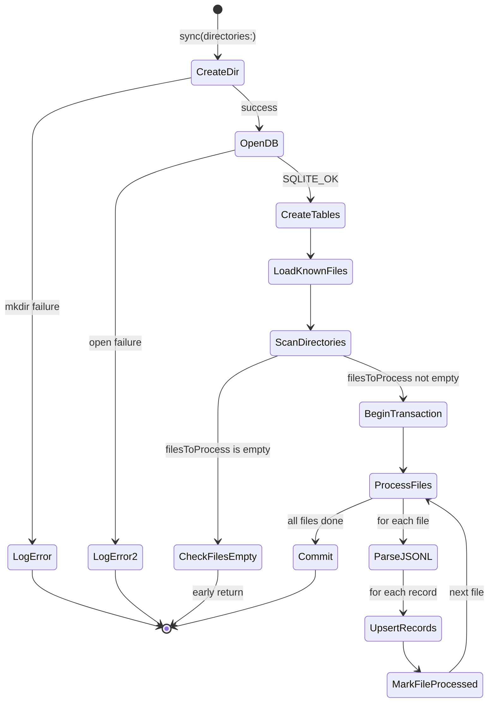

# Specification: TokenStore

## 0. Meta

| Source | Runtime |
|--------|---------|
| code/ClaudeUsageTracker/TokenStore.swift | Swift |

| Field | Value |
|-------|-------|
| Related | code/ClaudeUsageTracker/JSONLParser.swift (TokenRecord, JSONLParser.parseFile), code/ClaudeUsageTrackerShared/AppGroupConfig.swift (containerURL, appName) |
| Test Type | Unit / Integration |

## 1. Contract (Swift)

> AI Instruction: Treat this type definition as the single source of truth. Use it for mocks and test types.

```swift
/// Persists token records parsed from JSONL files into SQLite and provides query access.
/// Offers both static methods (via the shared singleton) and instance methods.
final class TokenStore {

    // MARK: - Properties

    let dbPath: String                          // SQLite DB file path
    private let dirURL: URL                     // Parent directory of dbPath
    private let iso: ISO8601DateFormatter       // .withInternetDateTime, .withFractionalSeconds

    // MARK: - Init

    init(dbPath: String)

    // MARK: - Singleton

    /// Uses tokens.db within the App Group container.
    /// Falls back to tmp directory in DEBUG + XCTest environments.
    static let shared: TokenStore

    // MARK: - Static convenience (delegates to shared)

    static func sync(directories: [URL])
    static func loadAll() -> [TokenRecord]
    static func loadRecords(since cutoff: Date) -> [TokenRecord]

    // MARK: - Instance methods

    /// Incrementally syncs JSONL files. Only parses files that have changed.
    func sync(directories: [URL])

    /// Returns all records ordered by timestamp ASC.
    func loadAll() -> [TokenRecord]

    /// Returns records since the cutoff date, ordered by timestamp ASC.
    func loadRecords(since cutoff: Date) -> [TokenRecord]
}
```

### Dependent type (defined in JSONLParser.swift)

```swift
struct TokenRecord {
    let timestamp: Date
    let requestId: String           // PRIMARY KEY (token_records table)
    let model: String
    let speed: String               // Read from DB column speed (DEFAULT 'standard')
    let inputTokens: Int
    let outputTokens: Int
    let cacheReadTokens: Int
    let cacheCreationTokens: Int
    let webSearchRequests: Int      // Read from DB column web_search_requests (DEFAULT 0)
}
```

## 2. State (Mermaid)

> AI Instruction: Generate tests covering all paths (Success/Failure/Edge) shown in this transition diagram.

TokenStore itself is stateless. Each method call opens, operates on, and closes the SQLite database. The internal flow of sync() is shown below.



## 3. Logic (Decision Table)

> AI Instruction: Generate a Unit Test for each row as a parameterized XCTest (per-case test method or loop).

### 3.1 shared singleton initialization

| Case ID | Environment | Expected | Notes |
|---------|-------------|----------|-------|
| UT-01 | DEBUG + XCTest environment | tmpDir/ClaudeUsageTracker-test-shared/tokens.db | ProcessInfo XCTestConfigurationFilePath != nil |
| UT-02 | Normal execution | AppGroupConfig.containerURL/Library/Application Support/{appName}/tokens.db | App Group container |
| EX-01 | Normal execution + containerURL == nil | fatalError | App Group not configured |

### 3.2 sync() -- file scanning and skip logic

| Case ID | Input | Expected | Notes |
|---------|-------|----------|-------|
| UT-10 | directories is empty array | DB created only, 0 records | filesToProcess is empty, early return |
| UT-11 | 1 new .jsonl file | parse -> upsert -> markFileProcessed | not in known |
| UT-12 | Known file (mod_date diff < 1.0s) | skip | diff between known[path] and modTime < 1.0 |
| UT-13 | Known file but mod_date changed (diff >= 1.0s) | re-parse -> upsert | file update detected |
| UT-14 | Non-.jsonl extension | skip | pathExtension != "jsonl" |
| UT-15 | Multiple directories, multiple files | all files processed | executed in 1 transaction |

### 3.3 upsertRecord() -- UPSERT logic

| Case ID | State | Input | Expected | Notes |
|---------|-------|-------|----------|-------|
| UT-20 | request_id does not exist | record | INSERT | new insertion |
| UT-21 | request_id exists, excluded.output_tokens >= existing | record (output_tokens larger or equal) | all fields updated with excluded values | >= so equal values also use excluded. CASE WHEN selects excluded |
| UT-22 | request_id exists, excluded.output_tokens < existing | record (output_tokens smaller) | all columns retain existing values (timestamp, model, input_tokens, output_tokens, cache_read, cache_creation) | excluded loses the >= comparison on output_tokens, so CASE WHEN retains all existing values |

### 3.4 loadAll()

| Case ID | DB state | Expected | Notes |
|---------|----------|----------|-------|
| UT-30 | DB has records | all records returned in timestamp ASC order | SQLITE_OPEN_READONLY |
| UT-31 | DB is empty | empty array | |
| EX-02 | DB file missing / open failure | empty array | guard early return |

### 3.5 loadRecords(since:)

| Case ID | Input | DB state | Expected | Notes |
|---------|-------|----------|----------|-------|
| UT-40 | cutoff = 1 hour ago | records before and after cutoff | only records at or after cutoff returned | WHERE timestamp >= ? |
| UT-41 | cutoff = future date | records exist | empty array | all records before cutoff |
| UT-42 | cutoff = past date | records exist | all records returned | all records at or after cutoff |
| EX-03 | any | DB open failure | empty array | |

### 3.6 queryRecords() -- internal helper

| Case ID | Input | Expected | Notes |
|---------|-------|----------|-------|
| UT-50 | bindTimestamp == nil | all rows fetched without binding | called from loadAll() |
| UT-51 | bindTimestamp != nil | rows fetched with ? bound | called from loadRecords(since:) |
| UT-52 | Column value is NULL (reqId/tsRaw/modelRaw) | row skipped (continue) | guard let nil check |
| UT-53 | timestamp not parseable as ISO8601 | row skipped (continue) | iso.date(from:) == nil |

## 4. Side Effects (Integration)

> AI Instruction: In integration tests, use spies/mocks to verify the following side effects.

| Type | Description |
|------|-------------|
| FileManager | createDirectory(at:withIntermediateDirectories:) -- creates DB parent directory at the start of sync() |
| FileManager | enumerator(at:includingPropertiesForKeys:options:) -- scans for JSONL files |
| SQLite3 | sqlite3_open / sqlite3_open_v2 -- DB connection (sync uses read-write, load methods use READONLY) |
| SQLite3 | sqlite3_exec("BEGIN TRANSACTION") / sqlite3_exec("COMMIT") -- batch write in sync() |
| SQLite3 | CREATE TABLE IF NOT EXISTS -- jsonl_files, token_records tables + idx_token_timestamp index |
| SQLite3 | INSERT ... ON CONFLICT DO UPDATE -- idempotent write via upsertRecord() |
| SQLite3 | INSERT OR REPLACE -- file processing record via markFileProcessed() |
| SQLite3 | SELECT -- reads via loadKnownFiles(), queryRecords() |
| JSONLParser | parseFile(_:) -- JSONL file parsing (external dependency) |

## 5. Notes

- **Idempotency**: The upsert logic makes re-processing the same file safe. When output_tokens is greater than or equal to the existing value, all fields (timestamp, model, input_tokens, output_tokens, cache_read, cache_creation) are updated with the excluded record. When output_tokens is smaller, all fields retain their existing values. This design prioritizes completed records over partial streaming records.
- **UPSERT is all-or-nothing per record**: The ON CONFLICT DO UPDATE clause uses an output_tokens comparison (>=) to determine whether to adopt the excluded or existing values, and **switches all columns together** (no partial updates).
- **Incremental sync**: The jsonl_files table records the mod_date of processed files, skipping files with no change (diff < 1.0s).
- **Transaction**: sync() wraps all file processing in a single transaction for performance.
- **speed / webSearchRequests**: Stored in SQLite columns `speed` (TEXT, DEFAULT 'standard') and `web_search_requests` (INTEGER, DEFAULT 0). Added to existing databases via idempotent `ALTER TABLE ADD COLUMN` migration in `createTables()`.
- **Separation of concerns in sync()**: File scanning is separated into `findFilesToProcess(directories:known:)`. sync() acts as an orchestrator: createTables -> loadKnownFiles -> findFilesToProcess -> transaction loop.
- **Test environment**: In DEBUG builds running under XCTest, a tmp directory is used instead of the App Group container, enabling isolation between tests.
