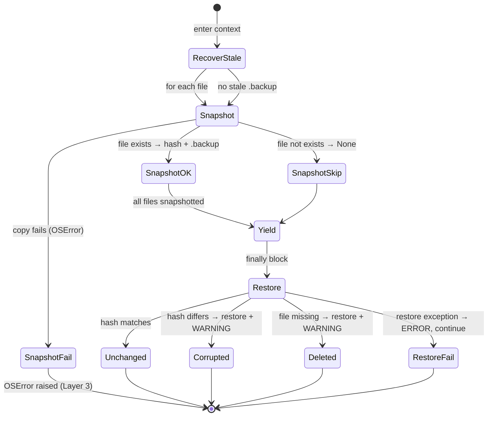
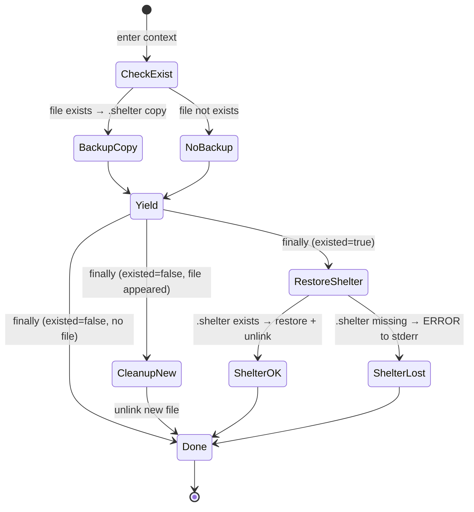

# data_protection.py Specification

## 0. Meta

| Source | Runtime |
|--------|---------|
| tools/lib/data_protection.py | Python 3.12+ |

| Field | Value |
|-------|-------|
| Related | docs/spec/tools/build-and-install.md |
| Test Type | pytest (code/tools/tests/) |

## Overview

File protection with guaranteed cleanup. Provides two context managers (`protect_files`, `shelter_file`) that ensure files are restored after dangerous operations (xcodebuild test, deploy). Three defense layers cover Python exceptions, SIGKILL/power loss, and disk full/permission errors.

## 1. Contract (Python)

> AI Instruction: この型定義を唯一の正解として扱い、モックやテストの型に使用すること。

```python
from contextlib import contextmanager
from pathlib import Path

def _sha256(path: Path) -> str:
    """Compute SHA-256 hash of a file (8192-byte chunks)."""
    ...

def _recover_stale_backup(file: Path) -> None:
    """Layer 2: If .backup exists from a crashed previous run, restore it and delete .backup."""
    ...

def _snapshot(file: Path) -> str | None:
    """Take a snapshot: record SHA-256 hash and create .backup via shutil.copy2.

    Returns:
        SHA-256 hash string, or None if file doesn't exist.
    Raises:
        OSError: If shutil.copy2 fails (Layer 3: disk full, permission error).
        OSError: If .backup not found after copy (Layer 3: verification).
    """
    ...

def _restore_if_changed(file: Path, hash_before: str | None) -> int:
    """Restore file if changed or deleted since snapshot.

    Returns:
        0: unchanged or skipped (file didn't exist at snapshot time)
        1: restored (file was corrupted — hash mismatch)
        2: restored (file was deleted)
    """
    ...

@contextmanager
def protect_files(*paths: str | Path):
    """Context manager that protects files from corruption during dangerous operations.

    On entry:
        1. Recover stale .backup from previous crash (Layer 2)
        2. Snapshot each file (hash + .backup copy)
    On exit (normal or exception):
        3. Restore any changed/deleted files (Layer 1: try/finally)
        4. If restore itself fails, continue with remaining files (no cascade)
    """
    ...

@contextmanager
def shelter_file(path: str | Path):
    """Unconditionally backup and restore a file around a block.

    Unlike protect_files:
        - No hash comparison — always restores silently
        - Uses .shelter extension (not .backup)
        - If file didn't exist before, deletes it after
        - If .shelter backup is lost, prints ERROR to stderr (cannot restore)
    """
    ...
```

## 2. State (Mermaid)

> AI Instruction: この遷移図の全パス（Success/Failure/Edge）を網羅するテストを生成すること。

### protect_files



### shelter_file



## 3. Logic (Decision Table)

> AI Instruction: 各行を pytest のパラメータ化テスト（ケースごとのテストメソッド or ループ）として Unit Test を生成すること。

### _sha256()

| Case ID | Input | Expected | Notes |
|---------|-------|----------|-------|
| SH-01 | 通常ファイル | SHA-256 hex文字列 | 8192バイトチャンクで読み込み |
| SH-02 | 空ファイル | SHA-256 of empty | hashlib.sha256().hexdigest() |

### _recover_stale_backup()

| Case ID | Input | Expected | Notes |
|---------|-------|----------|-------|
| RS-01 | .backup なし | 何もしない | |
| RS-02 | .backup あり | copy2 → unlink .backup + WARNING | Layer 2 |

### _snapshot()

| Case ID | Input | Expected | Notes |
|---------|-------|----------|-------|
| SN-01 | ファイルが存在 | hash文字列 + .backup作成 | 正常系 |
| SN-02 | ファイルが存在しない | None返却、.backup未作成 | |
| SN-03 | copy2が失敗 | OSError | Layer 3: disk full等 |
| SN-04 | copy後に.backupが存在しない | OSError | Layer 3: verification |

### _restore_if_changed()

| Case ID | Input | Expected | Notes |
|---------|-------|----------|-------|
| RC-01 | hash_before=None | 0 (skipped) | ファイルが元々存在しなかった |
| RC-02 | ファイル存在 + hash一致 | 0 (unchanged) + .backup削除 | |
| RC-03 | ファイル存在 + hash不一致 | 1 (corrupted) + restore + WARNING | |
| RC-04 | ファイル削除済み | 2 (deleted) + restore + WARNING | |

### protect_files()

| Case ID | Input | Expected | Notes |
|---------|-------|----------|-------|
| PF-01 | ブロック内で例外なし + ファイル未変更 | .backup削除のみ | Layer 1正常 |
| PF-02 | ブロック内で例外なし + ファイル変更 | restore + WARNING | |
| PF-03 | ブロック内でRuntimeError | ファイル復元 + 例外再raise | Layer 1 |
| PF-04 | 前回の.backupが残存 | 先にstale復元 → 通常処理 | Layer 2 |
| PF-05 | 複数ファイル + 1つの復元が失敗 | 他のファイルは復元続行 | ERROR出力 |
| PF-06 | 存在しないファイルを指定 | snapshot=None → skipped | |

### shelter_file()

| Case ID | Input | Expected | Notes |
|---------|-------|----------|-------|
| SF-01 | ファイル存在 + ブロック内で変更 | 元のファイルに復元 | |
| SF-02 | ファイル存在 + ブロック内で削除 | .shelterから復元 | |
| SF-03 | ファイル存在 + .shelterが消失 | ERROR to stderr | 復元不可 |
| SF-04 | ファイル非存在 + ブロック内で作成 | 作成されたファイルを削除 | |
| SF-05 | ファイル非存在 + ブロック内で変化なし | 何もしない | |

## 4. Side Effects (Integration)

> AI Instruction: 結合テストでは以下の副作用をスパイ/モックして検証すること。

| 種別 | 内容 |
|------|------|
| FileSystem | `shutil.copy2` — バックアップ作成・復元 |
| FileSystem | `Path.unlink` — .backup/.shelter 削除 |
| FileSystem | `Path.exists` — ファイル存在チェック |
| IO | `print(WARNING: ...)` — 復元時の警告出力（stdout） |
| IO | `print(ERROR: ..., file=sys.stderr)` — shelter backup消失時のエラー出力 |
| Hash | `hashlib.sha256` — ファイル整合性検証 |

## 5. Notes

- `.backup` = protect_files用、`.shelter` = shelter_file用（拡張子で区別）
- protect_files は可変長引数で複数ファイルを同時保護可能
- shelter_file は hash 比較をしない（常に復元）— cookie等の変更が想定されるファイル向け
- Layer 1（try/finally）は Python 例外をカバー。SIGKILL は Layer 2（次回実行時の stale .backup 検出）でカバー
- 復元失敗時に他のファイルの復元を中断しない（各ファイル独立して try/except）
