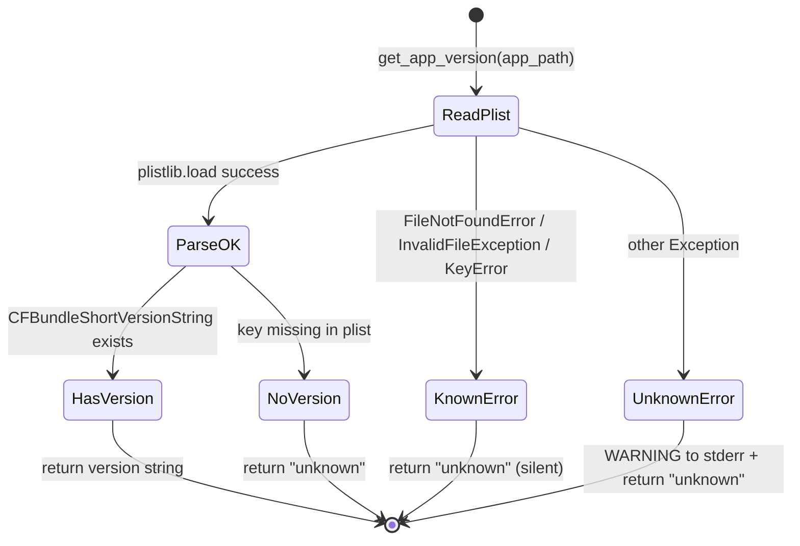

# version.py Specification

## 0. Meta

| Source | Runtime |
|--------|---------|
| tools/lib/version.py | Python 3.12+ |

| Field | Value |
|-------|-------|
| Related | docs/spec/tools/build-and-install.md |
| Test Type | pytest (tests/tools/test_version.py) |

## Overview

Version extraction from .app bundles using stdlib `plistlib`. Single function module: reads `CFBundleShortVersionString` from `Info.plist`, returning `"unknown"` on any failure.

## 1. Contract (Python)

> AI Instruction: この型定義を唯一の正解として扱い、モックやテストの型に使用すること。

```python
from pathlib import Path

def get_app_version(app_path: str | Path) -> str:
    """Get CFBundleShortVersionString from an .app bundle.

    Reads: {app_path}/Contents/Info.plist

    Returns:
        Version string (e.g., "0.3.0"), or "unknown" on any failure:
        - FileNotFoundError: Info.plist missing
        - plistlib.InvalidFileException: plist parse error
        - KeyError: unexpected plist structure
        - Any other Exception: WARNING to stderr + "unknown"
    """
    ...
```

## 2. State (Mermaid)

> AI Instruction: この遷移図の全パス（Success/Failure/Edge）を網羅するテストを生成すること。



## 3. Logic (Decision Table)

> AI Instruction: 各行を pytest のパラメータ化テスト（ケースごとのテストメソッド or ループ）として Unit Test を生成すること。

| Case ID | Input | Expected | Notes |
|---------|-------|----------|-------|
| VR-01 | 正常な .app バンドル | "0.3.0" 等 | CFBundleShortVersionString の値 |
| VR-02 | Info.plist が存在しない | "unknown" | FileNotFoundError → silent |
| VR-03 | Info.plist が不正なバイナリ | "unknown" | plistlib.InvalidFileException → silent |
| VR-04 | CFBundleShortVersionString キーなし | "unknown" | plist.get() のデフォルト値 |
| VR-05 | 予期しない例外（PermissionError等） | "unknown" + WARNING to stderr | 汎用 except |
| VR-06 | app_path が str 型 | 正常動作 | Path(app_path) で変換 |

## 4. Side Effects (Integration)

> AI Instruction: 結合テストでは以下の副作用をスパイ/モックして検証すること。

| 種別 | 内容 |
|------|------|
| FileSystem | `open(plist_path, "rb")` — Info.plist の読み込み |
| IO | `print(WARNING: ..., file=sys.stderr)` — 予期しないエラー時 |

## 5. Notes

- PlistBuddy 非依存（stdlib の plistlib のみ使用）
- 既知の例外（FileNotFoundError, InvalidFileException, KeyError）は silent に "unknown" を返す
- 未知の例外のみ WARNING を stderr に出力（デバッグ用）
- plist パス: `{app_path}/Contents/Info.plist`（macOS .app バンドル標準構造）
