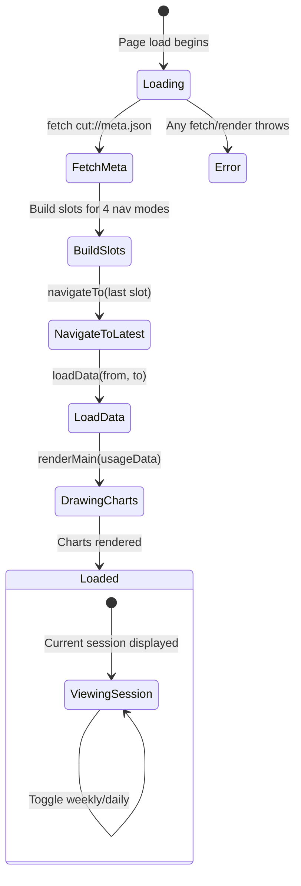

# Specification: AnalysisExporter

## 0. Meta

| Source | Runtime |
|--------|---------|
| `code/app/ClaudeUsageTracker/AnalysisExporter.swift` | Swift (container) + JavaScript/HTML/CSS (core) |

| Field | Value |
|-------|-------|
| Related | `documents/spec/analysis/overview.md`, `code/app/ClaudeUsageTracker/AnalysisSchemeHandler.swift` |
| Test Type | Unit (JS function logic) + Integration (end-to-end data flow) |

### Runtime Definition

| Value | Meaning |
|-------|---------|
| Swift (container) | Only `enum AnalysisExporter { static var htmlTemplate: String }`. No logic on the Swift side |
| JavaScript | All logic resides in `<script>` within the HTML template. Fetches JSON data via `cut://` endpoints, renders with Chart.js |

### Notes on the Source Table

- Although it is a Swift file, the substance is JS/HTML/CSS. The Swift side merely loads the HTML string from the bundle via `static var htmlTemplate`
- `AnalysisSchemeHandler` serves JSON data to the WKWebView via the `cut://` scheme (see Related)

## 1. Contract

### Swift Side

```swift
enum AnalysisExporter {
    static var htmlTemplate: String  // computed property: loads analysis.html from bundle
}

private final class BundleAnchor {}  // defined inside AnalysisExporter
```

#### `BundleAnchor` Class

```swift
private final class BundleAnchor {}
```

- A private class defined inside the `AnalysisExporter` enum
- Purpose: serves as an anchor for `Bundle(for: BundleAnchor.self)` to locate the bundle this file belongs to
- Swift enums cannot be passed directly to `Bundle(for:)` (which requires `AnyClass`), so this dummy class is a common workaround
- In unit test environments, the XCTest bundle becomes the execution bundle, so when `BundleAnchor` is in a test target, `Bundle(for: BundleAnchor.self)` points to the test bundle

#### `htmlTemplate` Computed Property Implementation

```swift
static var htmlTemplate: String {
    guard let url = Bundle(for: BundleAnchor.self).url(forResource: "analysis", withExtension: "html"),
          let html = try? String(contentsOf: url, encoding: .utf8) else {
        return "<html><body>Failed to load analysis template</body></html>"
    }
    return html
}
```

- Uses `var` (computed property), not `let`
- Reads `analysis.html` from the bundle on every invocation (no caching)
- Bundle resource name: `"analysis"`, extension: `"html"`
- Fallback HTML on load failure: `"<html><body>Failed to load analysis template</body></html>"`

### JavaScript Side (Function Signatures)

```typescript
// --- Data Loading ---
async function fetchJSON(url: string): Promise<any[] | null>
async function loadData(fromEpoch?: number, toEpoch?: number): Promise<{ usageData: UsageRecord[] }>

// --- Data Processing ---
function insertResetPoints(data: UsageRecord[], percentKey: string, resetsAtKey: string): Point[]
function buildWeeklySessions(data: UsageRecord[]): Session[]
function buildHourlySessions(data: UsageRecord[]): Session[]
function findNearest(sortedData: Point[], targetX: number): Point | null

// --- Chart Rendering ---
function renderUsageTab(): void
function renderMain(usageData: UsageRecord[]): void
function destroyAllCharts(): void

// --- Session Navigation ---
function buildSessionSlots(sessions: {id, resets_at}[], windowSec: number): Slot[]
function buildCalendarSlots(oldest: number, latest: number, stepSec: number, labelFn: (Date) => string): Slot[]
function switchMode(mode: NavMode): void
function updateNavUI(): void
async function navigateTo(index: number): Promise<void>
function initNavigation(): void

// --- Helpers ---
function timeXScale(): object
function createStripePattern(ctx, color, lineWidth, spacing): CanvasPattern
function formatDateShort(d: Date): string
function formatDateFull(d: Date): string

// --- Types (implicit) ---
interface UsageRecord {
  timestamp: number        // epoch seconds (Int)
  hourly_percent: number | null
  weekly_percent: number | null
  hourly_resets_at: number | null   // epoch seconds
  weekly_resets_at: number | null   // epoch seconds
}
interface Point {
  x: number   // epoch ms (Date value)
  y: number   // percent
}
type NavMode = 'sessionWeekly' | 'sessionHourly' | 'calWeek' | 'calDay'
interface MetaJSON {
  latestSevenDayResetsAt?: number  // epoch seconds
  latestTimestamp?: number         // epoch seconds
  oldestTimestamp?: number         // epoch seconds
  weeklySessions?: {id: number, resets_at: number}[]
  hourlySessions?: {id: number, resets_at: number}[]
}
interface Slot {
  from: number  // epoch seconds
  to: number    // epoch seconds
  label: string
}
```

## 2. State (Mermaid)



### Session Navigation (4 Modes)

- `_allSlots` object holds slots for all 4 modes: `sessionWeekly`, `sessionHourly`, `calWeek`, `calDay`
- `_navMode` tracks the active mode (default: `sessionWeekly`)
- `_navSlots` is the active mode's slot array, `_navIndex` points to the current slot
- Prev/Next buttons load data for adjacent slots via `navigateTo()`
- `switchMode(mode)` changes `_navSlots` to the selected mode's slots and navigates to the latest
- Session modes use `buildSessionSlots()` (from resets_at timestamps), calendrical modes use `buildCalendarSlots()` (fixed-width time windows)

## 3. Logic (Decision Table)

### 3.1 insertResetPoints(data, percentKey, resetsAtKey)

When a resets_at timestamp falls between prev and curr, inserts a usage-rate-0 point to visualize the reset.

| Case ID | data | percentKey | Expected | Notes |
|---------|------|-----------|----------|-------|
| RP-01 | `[{t:10:00, hourly%:30, resets:10:30}, {t:11:00, hourly%:15}]` | `hourly_percent` | `[{x:10:00, y:30}, {x:10:30, y:0}, {x:11:00, y:15}]` | resets_at between prev.t and curr.t -> zero point inserted |
| RP-02 | `[{t:10:00, hourly%:30, resets:09:00}, {t:11:00, hourly%:15}]` | `hourly_percent` | `[{x:10:00, y:30}, {x:11:00, y:15}]` | resets_at < prev.t -> no insertion |
| RP-03 | `[{t:10:00, hourly%:30, resets:12:00}, {t:11:00, hourly%:15}]` | `hourly_percent` | `[{x:10:00, y:30}, {x:11:00, y:15}]` | resets_at > curr.t -> no insertion |
| RP-04 | `[{t:10:00, hourly%:30, resets:null}, {t:11:00, hourly%:15}]` | `hourly_percent` | `[{x:10:00, y:30}, {x:11:00, y:15}]` | resets_at is null -> no insertion |
| RP-05 | `[{t:10:00, hourly%:null}, {t:11:00, hourly%:15}]` | `hourly_percent` | `[{x:11:00, y:15}]` | percent is null -> row itself is skipped |
| RP-06 | `[{t:10:00, hourly%:30, resets:10:30}, {t:11:00, hourly%:null}, {t:12:00, hourly%:20, resets:null}]` | `hourly_percent` | `[{x:10:00, y:30}, {x:10:30, y:0}, {x:12:00, y:20}]` | null in between; lastValidIdx tracks prev |
| RP-07 | `[]` | `hourly_percent` | `[]` | Empty array |
| RP-08 | `[{t:10:00, hourly%:50}]` | `hourly_percent` | `[{x:10:00, y:50}]` | Single record -> no reset evaluation |

**Note**: The comparison target for resets_at is `prev` (the most recent valid record), not curr. The condition is `resetTime > prevTime && resetTime < currTime` (strict open interval).

### 3.2 isGapSegment(ctx)

Chart.js segment callback. Determines whether the time difference between two points exceeds a threshold.

| Case ID | p1.x - p0.x (ms) | gapThresholdMs | Expected | Notes |
|---------|-------------------|----------------|----------|-------|
| GS-01 | 1,800,001 | 1,800,000 (30min) | `true` | Exceeds threshold (by 1ms) |
| GS-02 | 1,800,000 | 1,800,000 (30min) | `false` | Exactly at threshold (`>` so false) |
| GS-03 | 1,799,999 | 1,800,000 (30min) | `false` | Below threshold |
| GS-04 | 21,600,001 | 21,600,000 (360min) | `true` | Slider maximum |
| GS-05 | 300,001 | 300,000 (5min) | `true` | Slider minimum |

**Global state**: `gapThresholdMs` is dynamically changed via slider (default 30 * 60 * 1000 = 1,800,000ms).

### 3.3 formatMin(m) -- Gap Slider Display

| Case ID | m (minutes) | Expected | Notes |
|---------|-------------|----------|-------|
| FM-01 | 5 | `"5 min"` | Minimum value |
| FM-02 | 30 | `"30 min"` | Default |
| FM-03 | 59 | `"59 min"` | Largest below 1 hour |
| FM-04 | 60 | `"1h"` | Exactly 1 hour (remainder 0 -> no minutes shown) |
| FM-05 | 90 | `"1h 30min"` | Hours + minutes |
| FM-06 | 360 | `"6h"` | Maximum value |

### 3.4 renderMain(usageData) -- Summary Display

| Case ID | usageData | Expected | Notes |
|---------|-----------|----------|-------|
| MN-01 | 100 records | Renders usage chart | Normal |
| MN-02 | 0 records | Empty chart | No data |

## 4. Side Effects (Integration)

| Type | Description |
|------|-------------|
| Network (CDN) | `https://cdn.jsdelivr.net/npm/chart.js@4` -- Chart.js library |
| Network (CDN) | `https://cdn.jsdelivr.net/npm/chartjs-adapter-date-fns@3` -- Date adapter |
| Store (fetch) | `cut://usage.json` -- SELECT from usage_log table (AnalysisSchemeHandler serves as JSON) |
| Store (fetch) | `cut://meta.json` -- Aggregate query results from usage_log + weekly_sessions served as JSON |
| DOM | `#loading` -- text update + display:none |
| DOM | `#app` -- display:'' to show |
| DOM | `<canvas>` -- Chart.js instances render usage chart (usageTimeline) |
| DOM | `#gapSlider` -- input event updates `gapThresholdMs` + chart.update() |
| DOM | Session nav buttons -- prev/next + 4 mode buttons (Session Weekly/Hourly, Cal Week/Day) |
| Global State | `_usageData` -- set in renderMain() |
| Global State | `_meta` -- meta.json response |
| Global State | `_allSlots`, `_navMode`, `_navSlots`, `_navIndex` -- session navigation state |
| Global State | `_charts` -- Chart.js instance cache (for destroy) |
| Global State | `gapThresholdMs` -- gap threshold (changed via slider) |

## 5. Notes

- **CDN dependency**: Chart.js does not work offline (dynamically loaded from CDN)
- **fetchJSON error handling**: Returns `null` on fetch failure; the corresponding data array becomes empty. Errors are only logged via console.warn
- **Gap segment**: Chart.js's `segment` property sets borderColor/backgroundColor to `'transparent'` to hide lines. Slider changes are reflected without full chart redraw (`chart.update()` only)
- **Data serving architecture**: `AnalysisExporter.htmlTemplate` loads `analysis.html` from the bundle, and `AnalysisSchemeHandler` serves JSON endpoints via the `cut://` scheme
- **Session navigation**: Entry point fetches `meta.json` to get timestamp range and session lists, builds slots for all 4 modes (sessionWeekly, sessionHourly, calWeek, calDay), then navigates to the latest slot in the default mode (sessionWeekly)
