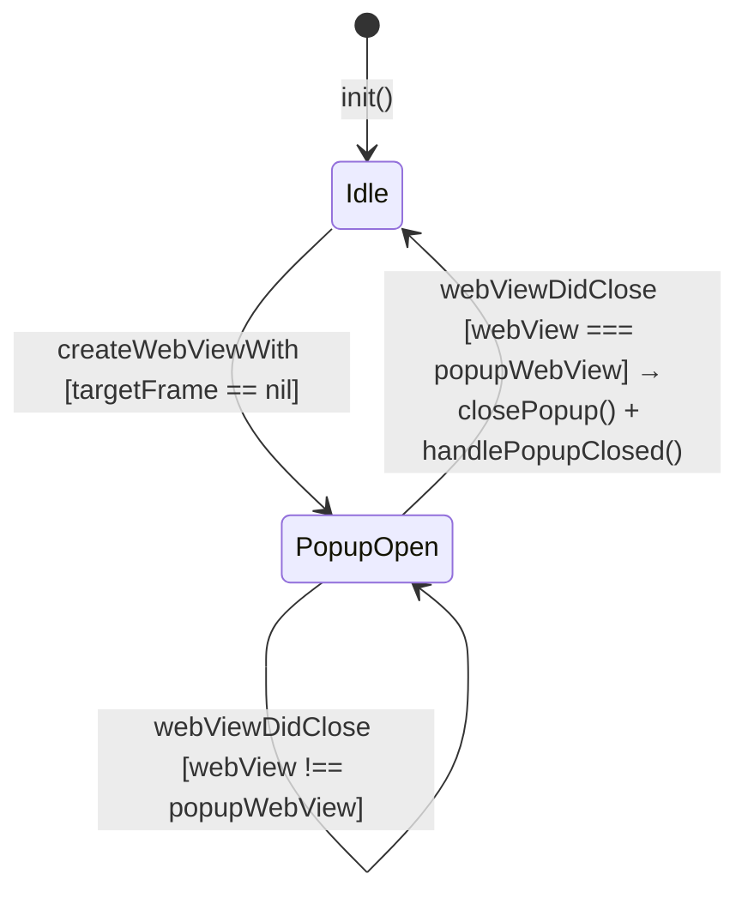

# WebViewCoordinator

## 0. Meta

| Source | Runtime |
|--------|---------|
| code/app/ClaudeUsageTracker/WebViewCoordinator.swift | Swift |

| Field | Value |
|-------|-------|
| Related | spec/meta/viewmodel-lifecycle.md, spec/meta/protocols.md, spec/meta/architecture.md |
| Test Type | Unit |

## 1. Contract

```swift
// MARK: - WebViewCoordinator

final class WebViewCoordinator: NSObject, WKNavigationDelegate, WKUIDelegate {
    private weak var viewModel: (any WebViewCoordinatorDelegate)?

    init(viewModel: any WebViewCoordinatorDelegate)

    // WKNavigationDelegate
    func webView(_ webView: WKWebView, didFinish navigation: WKNavigation!)

    // WKUIDelegate
    func webView(
        _ webView: WKWebView,
        createWebViewWith configuration: WKWebViewConfiguration,
        for navigationAction: WKNavigationAction,
        windowFeatures: WKWindowFeatures
    ) -> WKWebView?

    func webViewDidClose(_ webView: WKWebView)
}

// MARK: - CookieChangeObserver

final class CookieChangeObserver: NSObject, WKHTTPCookieStoreObserver {
    private let onChange: () -> Void

    init(onChange: @escaping () -> Void)

    // WKHTTPCookieStoreObserver
    func cookiesDidChange(in cookieStore: WKHTTPCookieStore)
}
```

## 2. State

WebViewCoordinator itself holds no state. It only maintains a weak reference to `viewModel`. The popup WebView state transitions mediated by the Coordinator are as follows.



## 3. Logic

### 3.1 didFinish (WKNavigationDelegate)

| Condition | WebView type | host | Called method | Notes |
|-----------|-------------|------|--------------|-------|
| viewModel == nil | - | - | (return) | Weak reference has been released |
| viewModel != nil | popup (=== viewModel.popupWebView) | any | viewModel.checkPopupLogin() | Outputs URL to debug log, then returns |
| viewModel != nil | main | "claude.ai" | viewModel.handlePageReady() | When host matches |
| viewModel != nil | main | != "claude.ai" or nil | (skip) | Debug log output only |

Main vs popup distinction is made via identity check: `webView === viewModel.popupWebView`.

### 3.2 createWebViewWith (WKUIDelegate — OAuth Popup Creation)

| Condition | Return Value | Side Effects |
|-----------|-------------|--------------|
| viewModel == nil | nil | None |
| navigationAction.targetFrame != nil | nil | None (regular links are not handled by the Coordinator) |
| viewModel != nil && targetFrame == nil | WKWebView (popup) | configuration.preferences.javaScriptCanOpenWindowsAutomatically = true, popup.navigationDelegate = self, viewModel.popupWebView = popup |

`targetFrame == nil` identifies a popup window (WebKit specification: new windows opened via `window.open()` etc. have nil targetFrame).

### 3.3 webViewDidClose (WKUIDelegate — Popup Closure)

| Condition | Called method |
|-----------|-------------|
| viewModel == nil | (return) |
| webView !== viewModel.popupWebView | (return / no-op) |
| webView === viewModel.popupWebView | viewModel.closePopup(), viewModel.handlePopupClosed() |

### 3.4 cookiesDidChange (CookieChangeObserver)

| Condition | Called method |
|-----------|-------------|
| Always | onChange() |

CookieChangeObserver is a pure callback forwarder with no conditional logic. Evaluation logic is delegated to the UsageViewModel side (e.g., `hasValidSession` checks).

## 4. Side Effects

| Method | Side Effects |
|--------|-------------|
| `didFinish` (popup) | Log output via `viewModel.debug()`, potential login state check and popup close via `viewModel.checkPopupLogin()` |
| `didFinish` (main, claude.ai) | Potential session check, fetch, and redirect via `viewModel.handlePageReady()` |
| `didFinish` (main, other host) | Log output via `viewModel.debug()` only |
| `createWebViewWith` | Modifies `configuration.preferences`, assigns new WKWebView to `viewModel.popupWebView`, returning the new WKWebView to WebKit triggers sheet display |
| `webViewDidClose` | Sheet closure via `viewModel.closePopup()`, potential `handleSessionDetected()` call after 1 second via `viewModel.handlePopupClosed()` |
| `cookiesDidChange` | Invokes the `onChange` closure (on the UsageViewModel side, this evaluates cookie validity and may lead to `handleSessionDetected()`) |

### Responsibility Split with viewmodel-lifecycle.md

`viewmodel-lifecycle.md` documents the specifications for `handlePageReady()`, `checkPopupLogin()`, `handlePopupClosed()`, and `handleSessionDetected()`. This spec documents only the **trigger conditions (WebKit delegate decision logic)** that invoke those methods, delegating the behavior of the called methods to viewmodel-lifecycle.md.
