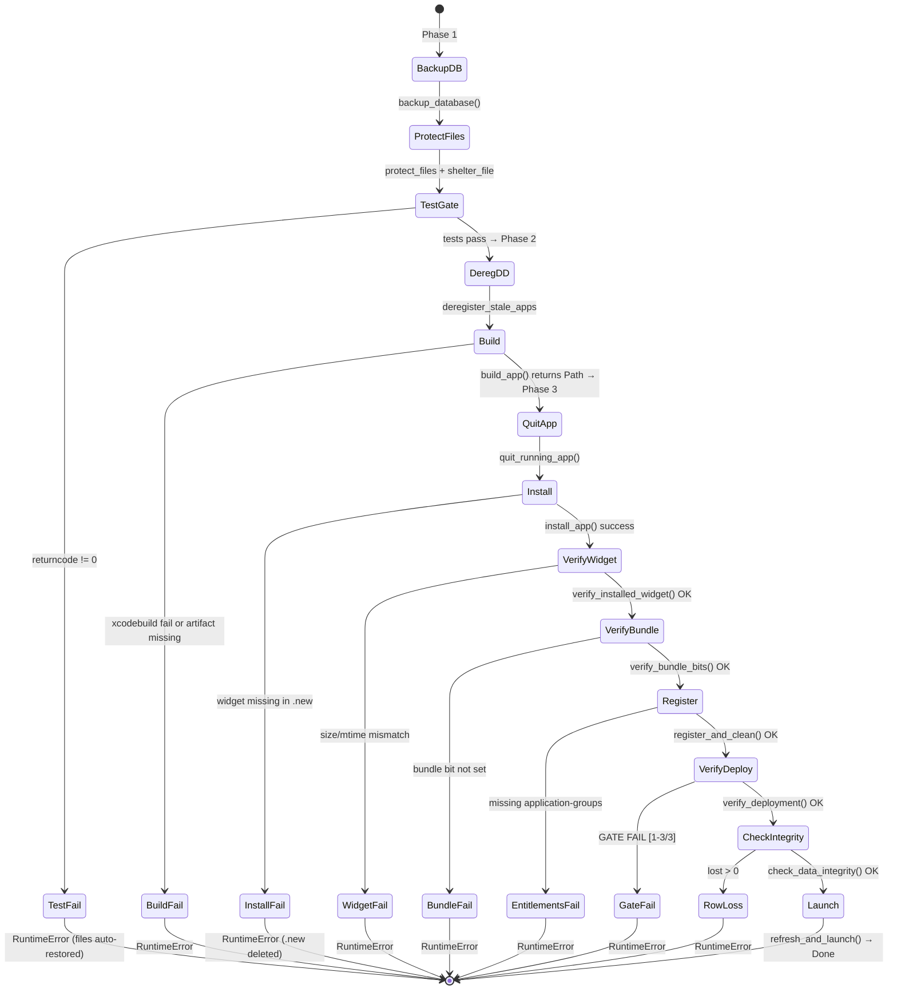
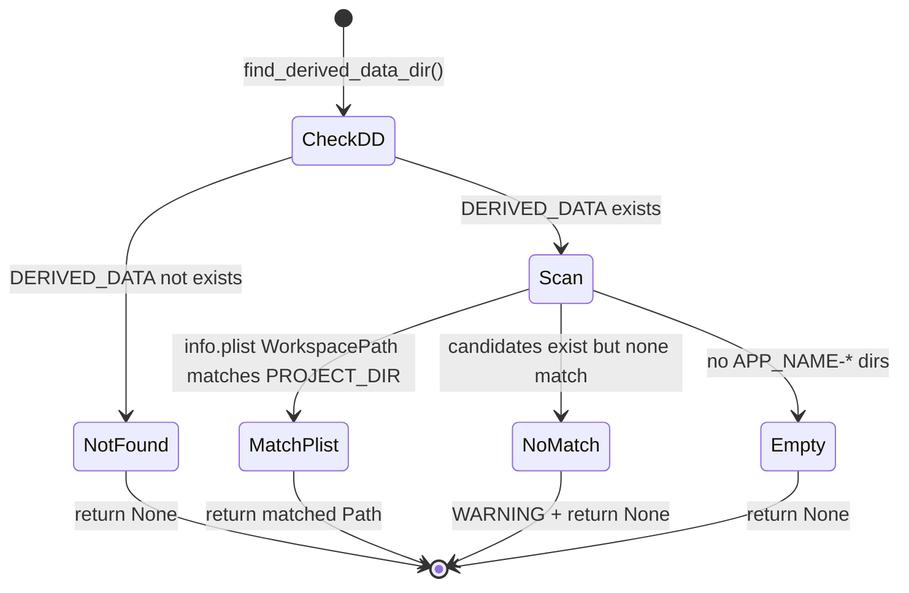
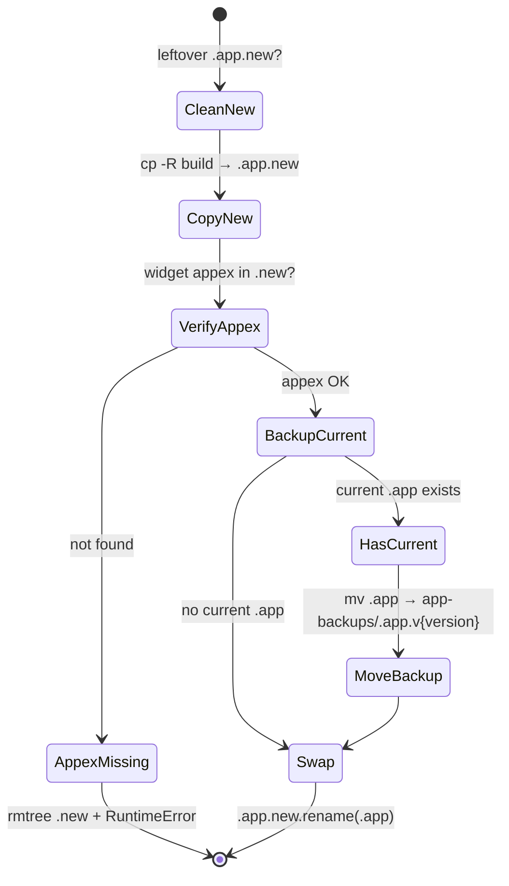

# build_and_install.py Specification

## 0. Meta

| Source | Runtime |
|--------|---------|
| tools/build_and_install.py | Python 3.12+ |

| Field | Value |
|-------|-------|
| Related | documents/spec/tools/rollback.md, documents/spec/tools/data-protection.md, documents/spec/tools/db-backup.md, documents/spec/tools/launchservices.md, documents/spec/tools/version.md, documents/spec/tools/runner.md |
| Test Type | pytest (tests/tools/) |

## Overview

Deploy script that performs build, test, and install in a single run. Orchestrates lib modules for data protection, DB backup, LaunchServices management, and version retrieval. All functions are in `build_and_install.py`; lib modules have their own specs.

## 1. Contract (Python)

> AI Instruction: この型定義を唯一の正解として扱い、モックやテストの型に使用すること。

### Constants

```python
PROJECT_DIR: Path      # Script's grandparent directory (project root)
APP_NAME: str          # "ClaudeUsageTracker"
SCHEME: str            # "ClaudeUsageTracker"
DERIVED_DATA: Path     # ~/Library/Developer/Xcode/DerivedData
INSTALL_DIR: Path      # /Applications
APPGROUP_DIR: Path     # ~/Library/Group Containers/group.grad13.claudeusagetracker/Library/Application Support/ClaudeUsageTracker
APPGROUP_DB: Path      # APPGROUP_DIR / "usage.db"
APPGROUP_SETTINGS: Path  # APPGROUP_DIR / "settings.json"
COOKIE_FILE: Path      # APPGROUP_DIR / "session-cookies.json"
WIDGET_ID: str         # "grad13.claudeusagetracker.widget"
```

### Functions

```python
def find_derived_data_dir() -> Path | None:
    """Find the DerivedData directory for THIS project.

    Search: DERIVED_DATA / "{APP_NAME}-*" directories
    Match: info.plist → WorkspacePath contains PROJECT_DIR
    Fallback: None (logs WARNING if candidates exist but none match)
    """
    ...

def run_test_gate() -> None:
    """Run xcodebuild test. Prints last 5 lines of output.

    Raises: RuntimeError if tests fail (returncode != 0).
    Note: Uses on_error="warn" for run() to capture output before raising.
    """
    ...

def build_app() -> Path:
    """Build the app and return path to built .app.

    Steps:
        1. Find DerivedData dir
        2. Remove stale xctest from DerivedData (left by xcodebuild test)
        3. xcodebuild clean build
        4. Re-find DerivedData if not found in step 1 (fresh build case)
        5. Verify build artifact exists

    Returns: Path to DerivedData/.../Debug/{APP_NAME}.app
    Raises: RuntimeError if build fails or artifact not found.
    """
    ...

def quit_running_app() -> None:
    """Quit the running app gracefully, then force-kill.

    Sequence:
        1. osascript quit (on_error="warn")
        2. sleep(2) — wait for quit event + state flush
        3. killall (on_error="warn")
        4. sleep(0.5) — wait for process termination
    """
    ...

def install_app(build_app_path: Path) -> None:
    """Atomic install: cp .new → verify widget → backup current → mv swap.

    Steps:
        1. Clean up leftover .app.new (rmtree)
        2. cp -R build to .app.new
        3. Verify widget appex exists in .new
           - If missing: rmtree .new + RuntimeError (current app untouched)
        4. If current .app exists:
           - Get version via get_app_version()
           - mv current to APPGROUP_DIR/app-backups/.app.v{version}
        5. rename .app.new → .app (atomic)

    Raises: RuntimeError on widget missing or copy failure.
    """
    ...

def verify_installed_widget(build_app_path: Path, installed_app: Path) -> None:
    """Verify installed widget binary matches build and set bundle bit.

    Checks:
        - Binary size: installed vs source (RuntimeError on mismatch)
        - Binary mtime: installed must not be older than source (RuntimeError if stale)
    Then: SetFile -a B (bundle bit)
    """
    ...

def _verify_widget_deployment(app_path: str) -> None:
    """Deployment verification gate: 3 conditions, all must pass.

    | # | Condition | Check |
    |---|-----------|-------|
    | 1 | Widget in pluginkit | WIDGET_ID in pluginkit -m stdout |
    | 2 | No DerivedData ghost in pluginkit | "DerivedData" not in pluginkit -m stdout |
    | 3 | No ghost LS registration | "DerivedData" not in dump_widget_registration() |

    Raises: RuntimeError with "GATE FAIL [N/3]" on any failure.
    """
    ...

def verify_bundle_bits(app_path: str) -> None:
    """Verify bundle bit via GetFileInfo.

    Parses "attributes:" line for "B" flag.
    Raises: RuntimeError if bundle bit not set.
    """
    ...

def register_and_clean(app_path: str) -> None:
    """Deregister stale copies, verify entitlements, register app, restart widget processes.

    Steps:
        1. deregister_stale_apps(APP_NAME, DERIVED_DATA)
        2. codesign -d --entitlements on app + widget → require "application-groups"
        3. register_app(app_path) + pluginkit -e use
        4. killall: widget extension → chronod → NotificationCenter (in order)
        5. sleep(3) — wait for chronod restart

    Raises: RuntimeError if entitlements missing.
    """
    ...

def verify_deployment(app_path: str) -> None:
    """Wrapper: calls _verify_widget_deployment(app_path)."""
    ...

def check_data_integrity(backup_file: Path | None) -> None:
    """Check no rows were lost during deploy.

    Skips if: backup_file is None, or doesn't exist, or APPGROUP_DB doesn't exist.
    Uses: check_lost_rows() from db_backup.
    Raises: RuntimeError if lost > 0 (displays backup path for manual recovery).
    On sqlite3.Error: WARNING (non-fatal).
    """
    ...

def refresh_and_launch(app_path: str) -> None:
    """killall Dock (icon cache refresh) + sleep(2) + open app."""
    ...

def main() -> None:
    """Entry point: orchestrates full deploy pipeline.

    Phase 1: backup_database + protect_files(settings) + shelter_file(cookies) + test gate
    Phase 2: deregister DerivedData + build_app
    Phase 3: quit → install → verify widget → verify bundle bits → register → verify deployment → check integrity → launch
    """
    ...
```

## 2. State (Mermaid)

> AI Instruction: この遷移図の全パス（Success/Failure/Edge）を網羅するテストを生成すること。

### main() — Full Deploy Pipeline



### find_derived_data_dir()



### install_app()



## 3. Logic (Decision Table)

> AI Instruction: 各行を pytest のパラメータ化テスト（ケースごとのテストメソッド or ループ）として Unit Test を生成すること。

### find_derived_data_dir()

| Case ID | Input | Expected | Notes |
|---------|-------|----------|-------|
| FD-01 | DERIVED_DATA 不存在 | None | |
| FD-02 | 1つのDD dir + WorkspacePath一致 | その Path | info.plist 読み取り |
| FD-03 | 2つのDD dir + 1つ一致 | 一致した Path | |
| FD-04 | DD dir存在 + WorkspacePath不一致 | None + WARNING | |
| FD-05 | info.plist なし | candidates に追加、最終的に None | |
| FD-06 | info.plist 読み取りエラー | 例外握りつぶし → candidates に追加 | |

### run_test_gate()

| Case ID | Input | Expected | Notes |
|---------|-------|----------|-------|
| TG-01 | テスト成功 (rc=0) | 正常終了 | 最後5行出力 |
| TG-02 | テスト失敗 (rc!=0) | RuntimeError | |

### build_app()

| Case ID | Input | Expected | Notes |
|---------|-------|----------|-------|
| BA-01 | ビルド成功 + artifact存在 | Path返却 | |
| BA-02 | ビルド失敗 (rc!=0) | RuntimeError | |
| BA-03 | ビルド成功 + DD見つからない | RuntimeError | |
| BA-04 | ビルド成功 + artifact不存在 | RuntimeError | |
| BA-05 | stale xctest存在 | rmtreeで削除 → ビルド続行 | |

### install_app()

| Case ID | Input | Expected | Notes |
|---------|-------|----------|-------|
| IA-01 | 正常 + 既存app有 | backup + swap | |
| IA-02 | 正常 + 既存appなし | swap のみ | |
| IA-03 | widget appex不存在 | RuntimeError + .new削除 | current app untouched |
| IA-04 | leftover .new存在 | 先にrmtree → 通常処理 | |

### verify_installed_widget()

| Case ID | Input | Expected | Notes |
|---------|-------|----------|-------|
| VW-01 | size一致 + mtime正常 | OK + SetFile | |
| VW-02 | sizeミスマッチ | RuntimeError | |
| VW-03 | mtime古い（stale） | RuntimeError | |
| VW-04 | widget_bin不存在 | SetFile実行のみ | 比較スキップ |

### _verify_widget_deployment()

| Case ID | Input | Expected | Notes |
|---------|-------|----------|-------|
| VD-01 | 3条件全てパス | OK (3/3) | |
| VD-02 | WIDGET_ID not in pluginkit stdout | GATE FAIL [1/3] RuntimeError | |
| VD-03 | "DerivedData" in pluginkit stdout | GATE FAIL [2/3] RuntimeError | |
| VD-04 | "DerivedData" in dump_widget_registration | GATE FAIL [3/3] RuntimeError | |

### verify_bundle_bits()

| Case ID | Input | Expected | Notes |
|---------|-------|----------|-------|
| VB-01 | attributes に "B" あり | OK | |
| VB-02 | attributes に "B" なし | RuntimeError | |
| VB-03 | GetFileInfo 失敗 | スキップ（on_error="warn"） | |

### register_and_clean()

| Case ID | Input | Expected | Notes |
|---------|-------|----------|-------|
| RC-01 | entitlements正常 | deregister + register + process kill | |
| RC-02 | app に application-groups なし | RuntimeError | |
| RC-03 | widget に application-groups なし | RuntimeError | |

### check_data_integrity()

| Case ID | Input | Expected | Notes |
|---------|-------|----------|-------|
| CI-01 | backup_file=None | スキップ | |
| CI-02 | lost=0 | OK | |
| CI-03 | lost>0 | RuntimeError (backup path表示) | |
| CI-04 | sqlite3.Error | WARNING (非致命) | |

## 4. Side Effects (Integration)

> AI Instruction: 結合テストでは以下の副作用をスパイ/モックして検証すること。

| 種別 | 内容 |
|------|------|
| Process | `xcodebuild test` — テスト実行 |
| Process | `xcodebuild clean build` — ビルド |
| Process | `osascript quit` + `killall` — アプリ終了 |
| Process | `cp -R` — ビルド成果物のコピー |
| Process | `SetFile -a B` — バンドルビット設定 |
| Process | `GetFileInfo` — バンドルビット確認 |
| Process | `codesign -d --entitlements` — エンタイトルメント確認 |
| Process | `pluginkit -m` — ウィジェットマニフェスト確認 |
| Process | `pluginkit -e use` — ウィジェット有効化 |
| Process | `killall` — widget extension, chronod, NotificationCenter, Dock |
| Process | `open` — アプリ起動 |
| FileSystem | `shutil.rmtree` — stale xctest 削除、.new 削除 |
| FileSystem | `shutil.move` — 現行アプリのバックアップ |
| FileSystem | `Path.rename` — .app.new → .app スワップ |
| FileSystem | `plistlib.load` — info.plist の読み取り（find_derived_data_dir） |
| Lib | `backup_database()` — DB バックアップ（db_backup.py） |
| Lib | `protect_files()` — ファイル保護（data_protection.py） |
| Lib | `shelter_file()` — Cookie 保護（data_protection.py） |
| Lib | `deregister_stale_apps()` — stale 登録解除（launchservices.py） |
| Lib | `register_app()` — LS 登録（launchservices.py） |
| Lib | `dump_widget_registration()` — LS ダンプ（launchservices.py） |
| Lib | `get_app_version()` — バージョン取得（version.py） |
| Lib | `check_lost_rows()` — 行ロス検出（db_backup.py） |

## 5. Notes

### Execution Flow

```
Phase 1: Data Protection + Test
  1. backup_database(APPGROUP_DB, APPGROUP_DIR)
  2. protect_files(APPGROUP_SETTINGS) + shelter_file(COOKIE_FILE)
  3. run_test_gate()
  4. (auto-restore on exit)

Phase 2: Build
  5. deregister_stale_apps (before build)
  6. build_app() — remove stale xctest + xcodebuild clean build

Phase 3: Deploy
  7. quit_running_app()
  8. install_app(build_app_path) — atomic swap
  9. verify_installed_widget() — size + mtime + bundle bit
  10. verify_bundle_bits() — GetFileInfo
  11. register_and_clean() — entitlements + LS register + process kill
  12. verify_deployment() — 3-condition gate
  13. check_data_integrity() — row loss detection
  14. refresh_and_launch() — Dock refresh + open
```

### App Group Path

```
$HOME/Library/Group Containers/group.grad13.claudeusagetracker/
  Library/Application Support/ClaudeUsageTracker/
  |-- usage.db
  |-- settings.json
  |-- session-cookies.json
  |-- backups/
  |   +-- usage_YYYYMMDD_HHMMSS.db (max 10)
  +-- app-backups/
      +-- ClaudeUsageTracker.app.v{version}
```

### Error Behavior Summary

| Situation | Behavior |
|-----------|----------|
| Test failure | RuntimeError (build/install not performed) |
| Build failure / artifact not found | RuntimeError |
| Widget appex not found in .new | RuntimeError (.new deleted, current untouched) |
| Widget binary stale/size mismatch | RuntimeError |
| Bundle bit not set | RuntimeError |
| Entitlements missing (application-groups) | RuntimeError |
| GATE FAIL [1-3/3] | RuntimeError |
| DB row loss detected | RuntimeError (displays backup path) |
| pluginkit -e use failure | WARNING (continues) |
| killall failure | WARNING (continues) |
| settings/cookies modification | WARNING + auto-restore (via protect_files/shelter_file) |

### Code Signing

Xcode signs all components during `xcodebuild build`. No manual re-signing needed:
- Scheme has `buildForTesting="NO"` — xctest not embedded during build
- Stale xctest removed from DerivedData before build
- Xcode re-signs automatically when xctest is missing

Principles (if manual re-signing ever needed):
- Never use `--deep` (overwrites nested entitlements)
- Inner → outer order: framework → appex → app
- Always use `--entitlements` flag

### Widget Extension Process Lifecycle

Kill order after registration (順序重要):
1. `killall ClaudeUsageTrackerWidgetExtension` — old binary process
2. `killall chronod` — launchd restarts; processes `extensionChanged`
3. `killall NotificationCenter` — discard rendering buffer

Extension must be killed before chronod to prevent reuse of old binary. `sleep(3)` after kill sequence for chronod restart.
