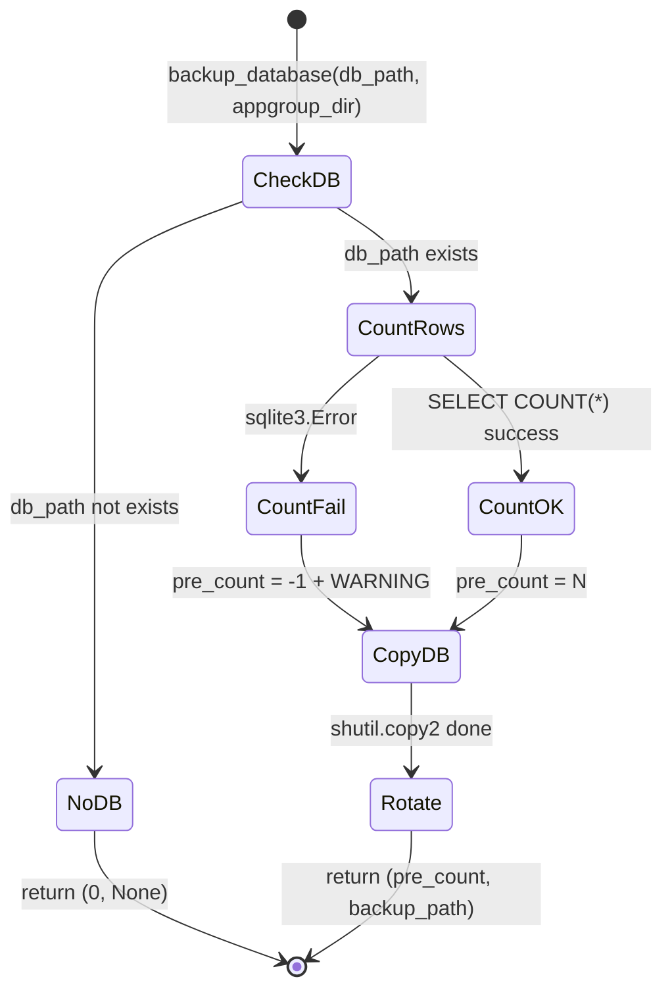
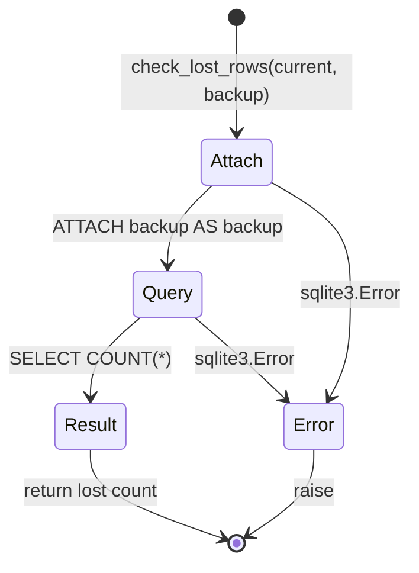

# db_backup.py Specification

## 0. Meta

| Source | Runtime |
|--------|---------|
| tools/lib/db_backup.py | Python 3.12+ |

| Field | Value |
|-------|-------|
| Related | documents/spec/tools/build-and-install.md |
| Test Type | pytest (tests/tools/test_build_and_install.py) |

## Overview

Database backup utilities for the deploy script. Provides backup with rotation (keep newest 10), pre-deploy row counting, and post-deploy row loss detection via ATTACH + COUNT comparison.

## 1. Contract (Python)

> AI Instruction: この型定義を唯一の正解として扱い、モックやテストの型に使用すること。

```python
from pathlib import Path

def rotate_backups(backup_dir: Path, keep: int = 10) -> None:
    """Rotate backup files, keeping the newest `keep` files.

    Files matched: backup_dir.glob("usage_*.db")
    Sort order: st_mtime descending (newest first)
    Action: unlink files beyond `keep` count
    """
    ...

def backup_database(db_path: Path, appgroup_dir: Path) -> tuple[int, Path | None]:
    """Backup usage.db and rotate old backups.

    Returns:
        (pre_count, backup_path)
        - pre_count: row count before backup. -1 if DB read failed (sentinel).
        - backup_path: Path to created backup, or None if db_path doesn't exist.

    Flow:
        1. If db_path doesn't exist → return (0, None)
        2. SELECT COUNT(*) FROM usage_log (PRAGMA query_only = ON)
        3. shutil.copy2 to backups/usage_YYYYMMDD_HHMMSS.db
        4. rotate_backups(keep=10)
    """
    ...

def check_lost_rows(current_db: str, backup_db: str) -> int:
    """Count rows in backup that are missing from current DB.

    SQL: ATTACH backup → SELECT COUNT(*) FROM backup.usage_log
         WHERE rowid NOT IN (SELECT rowid FROM main.usage_log)

    Returns: number of lost rows (0 = no loss)
    Raises: sqlite3.Error on SQL failure
    """
    ...
```

## 2. State (Mermaid)

> AI Instruction: この遷移図の全パス（Success/Failure/Edge）を網羅するテストを生成すること。

### backup_database



### check_lost_rows



## 3. Logic (Decision Table)

> AI Instruction: 各行を pytest のパラメータ化テスト（ケースごとのテストメソッド or ループ）として Unit Test を生成すること。

### rotate_backups()

| Case ID | Input | Expected | Notes |
|---------|-------|----------|-------|
| RO-01 | 0個のバックアップ | 何もしない | |
| RO-02 | 5個（keep=10） | 何もしない | 閾値未満 |
| RO-03 | 12個（keep=10） | 古い2個を unlink | mtime順で古い方を削除 |
| RO-04 | keep=0 | 全て削除 | エッジケース |

### backup_database()

| Case ID | Input | Expected | Notes |
|---------|-------|----------|-------|
| BD-01 | DB存在しない | (0, None) | 早期リターン |
| BD-02 | DB正常 + 50行 | (50, backup_path) | 正常系 |
| BD-03 | DB破損（sqlite3.Error） | (-1, backup_path) | sentinel値 + WARNING + バックアップは実行 |
| BD-04 | usage_logテーブルなし | (-1, backup_path) | sqlite3.OperationalError |

### check_lost_rows()

| Case ID | Input | Expected | Notes |
|---------|-------|----------|-------|
| CL-01 | current = backup（同一） | 0 | ロスなし |
| CL-02 | currentからrowid 3,5が欠落 | 2 | 欠落行数を返す |
| CL-03 | currentが空 | backup全行数 | 全行ロスト |
| CL-04 | backup DBが不正 | sqlite3.Error | ATTACH失敗 |

## 4. Side Effects (Integration)

> AI Instruction: 結合テストでは以下の副作用をスパイ/モックして検証すること。

| 種別 | 内容 |
|------|------|
| FileSystem | `shutil.copy2` — DB ファイルのバックアップ作成 |
| FileSystem | `Path.unlink` — 古いバックアップの削除（ローテーション） |
| FileSystem | `Path.mkdir(parents=True, exist_ok=True)` — backups ディレクトリ作成 |
| Database | `sqlite3.connect` — DB 接続（query_only ON） |
| Database | `ATTACH` — バックアップ DB の接続（check_lost_rows） |
| IO | `print(WARNING: ...)` — DB 読み取り失敗時 |
| IO | `print(==> DB backup: ...)` — バックアップ完了時 |

## 5. Notes

- `PRAGMA query_only = ON` でバックアップ前の COUNT 時に誤って書き込まないよう保護
- バックアップファイル名: `usage_YYYYMMDD_HHMMSS.db`（`datetime.now()` のフォーマット）
- pre_count = -1 は sentinel 値。DB エラー時でもバックアップ自体は実行する（データ保全優先）
- check_lost_rows は rowid ベースで比較。rowid が同じでも内容が変わっていても検出しない（行の「消失」のみ検出）
- rotate_backups は glob パターン `usage_*.db` にマッチするファイルのみ対象
