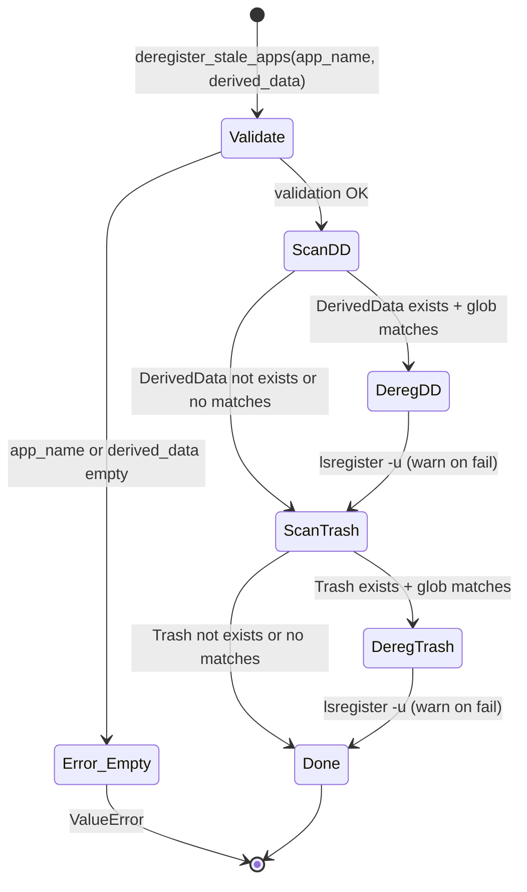
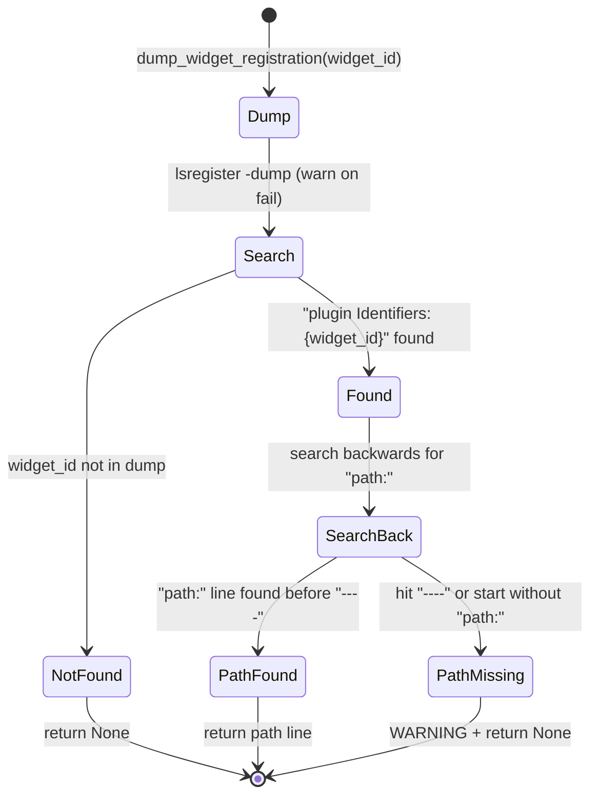

# launchservices.py Specification

## 0. Meta

| Source | Runtime |
|--------|---------|
| tools/lib/launchservices.py | Python 3.12+ |

| Field | Value |
|-------|-------|
| Related | documents/spec/tools/build-and-install.md, documents/spec/tools/rollback.md, documents/spec/tools/runner.md |
| Test Type | pytest (tests/tools/test_launchservices.py) |

## Overview

LaunchServices utilities for app registration management. Provides deregistration of stale app copies (DerivedData, Trash), force registration, and widget extension path querying via `lsregister -dump` parsing.

## 1. Contract (Python)

> AI Instruction: この型定義を唯一の正解として扱い、モックやテストの型に使用すること。

```python
from runner import run

LSREGISTER: str  # Full path to lsregister binary:
# "/System/Library/Frameworks/CoreServices.framework"
# "/Versions/Current/Frameworks/LaunchServices.framework"
# "/Versions/Current/Support/lsregister"

def deregister_stale_apps(app_name: str, derived_data: str) -> None:
    """Deregister stale app copies from DerivedData and Trash.

    Targets:
        - DerivedData: {derived_data}/{app_name}-*/Build/Products/*/{app_name}.app
        - Trash: ~/.Trash/{app_name}*.app

    Raises:
        ValueError: If app_name is empty.
        ValueError: If derived_data is empty.

    Note: lsregister -u failures are non-fatal (on_error="warn").
    """
    ...

def register_app(app_path: str) -> None:
    """Register an app with LaunchServices (force).

    Command: lsregister -f {app_path}
    Raises: RuntimeError on failure (on_error="raise").
    """
    ...

def dump_widget_registration(widget_id: str) -> str | None:
    """Query LaunchServices for a widget extension's registered path.

    Parses lsregister -dump output to find the entry matching widget_id.

    Search algorithm:
        1. Find line containing "plugin Identifiers:         {widget_id}"
        2. Search backwards from that line for "path:" within the same entry
        3. Entry boundary: line containing "----"

    Returns:
        The "path: ..." line if found, or None if:
        - widget_id not found in dump
        - widget_id found but no "path:" line in same entry (prints WARNING)
    """
    ...
```

## 2. State (Mermaid)

> AI Instruction: この遷移図の全パス（Success/Failure/Edge）を網羅するテストを生成すること。

### deregister_stale_apps



### dump_widget_registration



## 3. Logic (Decision Table)

> AI Instruction: 各行を pytest のパラメータ化テスト（ケースごとのテストメソッド or ループ）として Unit Test を生成すること。

### deregister_stale_apps()

| Case ID | Input | Expected | Notes |
|---------|-------|----------|-------|
| DS-01 | app_name="" | ValueError | 入力バリデーション |
| DS-02 | derived_data="" | ValueError | 入力バリデーション |
| DS-03 | DerivedData存在 + 2つのappディレクトリ | 2回 lsregister -u | globマッチ |
| DS-04 | DerivedData不存在 | DD スキップ → Trash確認 | |
| DS-05 | Trash存在 + 1つのappディレクトリ | 1回 lsregister -u | |
| DS-06 | Trash不存在 | Trash スキップ | |
| DS-07 | DerivedData内にファイル（非ディレクトリ） | is_dir()でスキップ | |
| DS-08 | lsregister -u が失敗 | WARNING出力 + 続行 | on_error="warn" |

### register_app()

| Case ID | Input | Expected | Notes |
|---------|-------|----------|-------|
| RA-01 | 有効なapp_path | lsregister -f 実行 | 正常系 |
| RA-02 | lsregister -f が失敗 | RuntimeError | on_error="raise"（デフォルト） |

### dump_widget_registration()

| Case ID | Input | Expected | Notes |
|---------|-------|----------|-------|
| DW-01 | widget_id がダンプに存在 + path行あり | "path: /Applications/..." | 正常系 |
| DW-02 | widget_id がダンプに存在しない | None | |
| DW-03 | widget_id 存在 + path行なし（----で区切り） | None + WARNING | エントリ内にpathなし |
| DW-04 | widget_id 存在 + path行なし（先頭到達） | None + WARNING | 逆方向探索で先頭到達 |
| DW-05 | lsregister -dump が失敗 | 空のstdout → None | on_error="warn" |

## 4. Side Effects (Integration)

> AI Instruction: 結合テストでは以下の副作用をスパイ/モックして検証すること。

| 種別 | 内容 |
|------|------|
| Process | `run([LSREGISTER, "-u", ...])` — stale app の登録解除 |
| Process | `run([LSREGISTER, "-f", ...])` — app の強制登録 |
| Process | `run([LSREGISTER, "-dump"])` — 全登録情報のダンプ |
| FileSystem | `Path.home() / ".Trash"` — Trash ディレクトリの探索 |
| FileSystem | `Path(derived_data).glob(...)` — DerivedData の探索 |
| IO | `print(WARNING: ...)` — path行が見つからない時 |

## 5. Notes

- `LSREGISTER` は macOS システムバイナリへのフルパス定数（ハードコード）
- deregister は冪等操作 — 未登録の app を deregister してもエラーにならない（warn のみ）
- register_app は on_error="raise"（デフォルト）で失敗時に RuntimeError
- dump_widget_registration のパース: `lsregister -dump` の出力は `----` 行でエントリ区切り。`plugin Identifiers:` 行から逆方向に `path:` を探す
- runner.py の `run()` に依存（import 時点で lib/ が sys.path にある前提）
