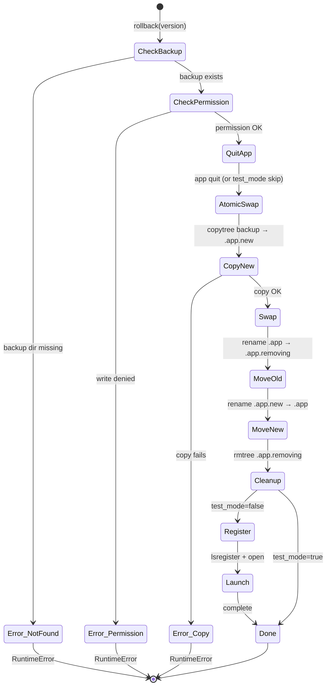

# Specification: rollback.py

## 0. Meta

| Source | Runtime |
|--------|---------|
| tools/rollback.py | Python 3.12+ |

| 項目 | 値 |
|------|-----|
| Related | documents/spec/tools/build-and-install.md, tools/lib/launchservices.py, tools/lib/runner.py |
| Test Type | pytest (tests/tools/test_rollback.py) |

## 1. Contract (Python)

> AI Instruction: この型定義を唯一の正解として扱い、モックやテストの型に使用すること。

```python
# Constants (env-overridable in TEST_MODE only)
APP_NAME: str          # "ClaudeUsageTracker" (fixed unless ROLLBACK_TEST_MODE)
INSTALL_DIR: Path      # /Applications (fixed unless ROLLBACK_TEST_MODE)
APPGROUP_DIR: Path     # ~/Library/Group Containers/.../ClaudeUsageTracker
APP_BACKUP_DIR: Path   # APPGROUP_DIR / "app-backups"

def list_versions() -> list[str]:
    """Return sorted list of available backup version strings (e.g. ["v0.2.0", "v0.3.0"]).
    Returns empty list if backup directory does not exist."""
    ...

def rollback(version: str, *, test_mode: bool = False) -> None:
    """Rollback to a specific version using atomic swap.
    Raises RuntimeError if backup not found or write permission denied."""
    ...

def main() -> None:
    """CLI entry point. No args: list versions. With arg: rollback to version."""
    ...
```

## 2. State (Mermaid)

> AI Instruction: この遷移図の全パス（Success/Failure/Edge）を網羅するテストを生成すること。



## 3. Logic (Decision Table)

> AI Instruction: 各行を pytest のパラメータ化テスト（ケースごとのテストメソッド or ループ）として Unit Test を生成すること。

### list_versions()

| Case ID | Input | Expected | Notes |
|---------|-------|----------|-------|
| LV-01 | APP_BACKUP_DIR が存在しない | `[]` | ディレクトリ未作成時 |
| LV-02 | APP_BACKUP_DIR に `.app.v0.2.0`, `.app.v0.3.0` | `["v0.2.0", "v0.3.0"]` | ソート済み |
| LV-03 | APP_BACKUP_DIR にファイル（非ディレクトリ）のみ | `[]` | `is_dir()` フィルタ |

### rollback()

| Case ID | Input | Expected | Notes |
|---------|-------|----------|-------|
| RB-01 | 存在しない version | `RuntimeError` | backup_app.is_dir() == False |
| RB-02 | 書き込み権限なし | `RuntimeError` | PermissionError → RuntimeError |
| RB-03 | 正常ロールバック (test_mode=True) | .app が backup の内容に置換 | LaunchServices/起動スキップ |
| RB-04 | .app.new が残存している状態で実行 | 残存を削除してから続行 | クリーンアップ処理 |
| RB-05 | 現在の .app が存在しない状態 | .new → .app のリネームのみ | 初回インストール相当 |
| RB-06 | copytree 中に FileExistsError | リトライ（rmtree → copytree） | race condition 対策 |

### main()

| Case ID | Input | Expected | Notes |
|---------|-------|----------|-------|
| MN-01 | 引数なし | バージョン一覧表示 + exit(1) | ヘルプ表示 |
| MN-02 | 引数あり + 正常 | rollback() 実行 | |
| MN-03 | RuntimeError 発生 | stderr 出力 + exit(1) | __main__ ブロック |

## 4. Side Effects (Integration)

> AI Instruction: 結合テストでは以下の副作用をスパイ/モックして検証すること。

| 種別 | 内容 |
|------|------|
| Process | `osascript quit` — アプリ終了要求 |
| Process | `killall APP_NAME` — 強制終了 |
| FileSystem | `shutil.copytree` — バックアップからコピー |
| FileSystem | `Path.rename` — アトミックスワップ (2回: .app→.removing, .new→.app) |
| FileSystem | `shutil.rmtree` — .removing 削除 |
| LaunchServices | `register_app()` — lsregister -f 登録 |
| Process | `open` — アプリ起動 |

## 5. Notes

- データ（DB, Cookie）はロールバック対象外（バイナリのみ）
- 環境変数 `ROLLBACK_TEST_MODE` でパス定数をオーバーライド可能（テスト専用）
- アトミック性: `cp → mv` の2段階で実現。中断時は `.app.new` or `.app.removing` が残り、次回実行時にクリーンアップ
