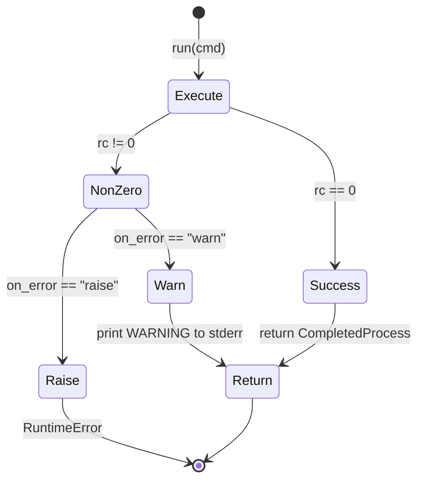

# Specification: runner.py

## 0. Meta

| Source | Runtime |
|--------|---------|
| tools/lib/runner.py | Python 3.12+ |

| 項目 | 値 |
|------|-----|
| Related | documents/spec/tools/build-and-install.md, documents/spec/tools/rollback.md |
| Test Type | pytest (tests/tools/test_runner.py) |

## 1. Contract (Python)

> AI Instruction: この型定義を唯一の正解として扱い、モックやテストの型に使用すること。

```python
import subprocess

def run(
    cmd: list[str],
    *,
    on_error: str = "raise",
    label: str = "",
) -> subprocess.CompletedProcess[str]:
    """Run a subprocess with consistent logging and error handling.

    Args:
        cmd: Command and arguments to execute.
        on_error: Error strategy.
            - "raise" (default): raise RuntimeError on non-zero exit.
            - "warn": print WARNING to stderr, do not raise.
        label: Optional prefix for error messages (e.g. "[label] rc=1: ...").

    Returns:
        subprocess.CompletedProcess with captured stdout and stderr (text mode).

    Raises:
        RuntimeError: If on_error="raise" and return code is non-zero.
            Message format: "[{label}] rc={N}: {stderr}" or "rc={N}: {stderr}"
    """
    ...
```

## 2. State (Mermaid)

> AI Instruction: この遷移図の全パス（Success/Failure/Edge）を網羅するテストを生成すること。



## 3. Logic (Decision Table)

> AI Instruction: 各行を pytest のパラメータ化テスト（ケースごとのテストメソッド or ループ）として Unit Test を生成すること。

| Case ID | cmd rc | on_error | label | Expected | Notes |
|---------|--------|----------|-------|----------|-------|
| RN-01 | 0 | "raise" | "" | CompletedProcess 返却 | 正常系 |
| RN-02 | 0 | "raise" | "test" | CompletedProcess 返却 | label は出力されない（成功時） |
| RN-03 | 1 | "raise" | "" | `RuntimeError("rc=1: {stderr}")` | デフォルト動作 |
| RN-04 | 1 | "raise" | "build" | `RuntimeError("[build] rc=1: {stderr}")` | label 付きエラー |
| RN-05 | 1 | "warn" | "" | WARNING to stderr + CompletedProcess 返却 | 非致命エラー |
| RN-06 | 1 | "warn" | "killall" | `WARNING: [killall] rc=1: ...` to stderr | label 付き警告 |
| RN-07 | 0 | "warn" | "" | CompletedProcess 返却 | warn でも成功時は警告なし |

## 4. Side Effects (Integration)

> AI Instruction: 結合テストでは以下の副作用をスパイ/モックして検証すること。

| 種別 | 内容 |
|------|------|
| Process | `subprocess.run(cmd, capture_output=True, text=True)` — 外部コマンド実行 |
| IO | `print(..., file=sys.stderr)` — 警告出力（on_error="warn" 時のみ） |

## 5. Notes

- `capture_output=True` により stdout/stderr が常にキャプチャされる
- テキストモード (`text=True`) で文字列として返却
- エラーメッセージは `stderr.strip()` で末尾改行を除去
- label が空文字の場合、`[label] ` プレフィックスは付与されない
